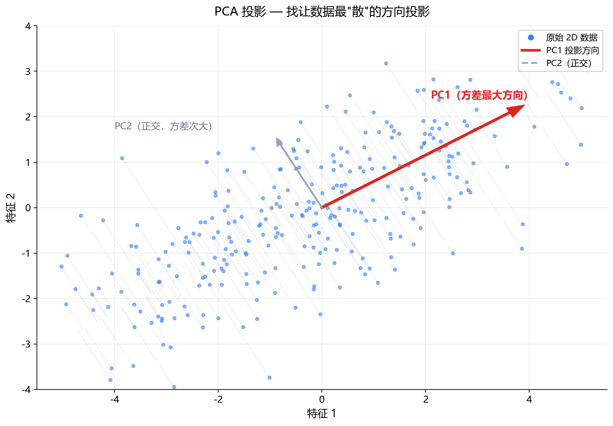
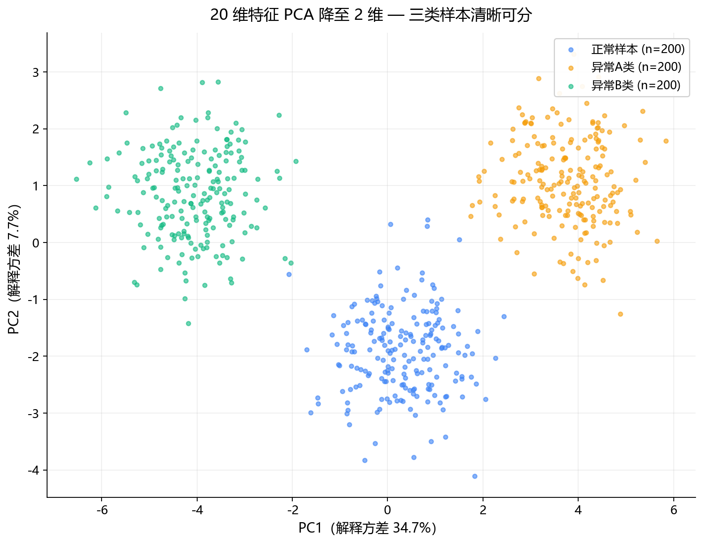
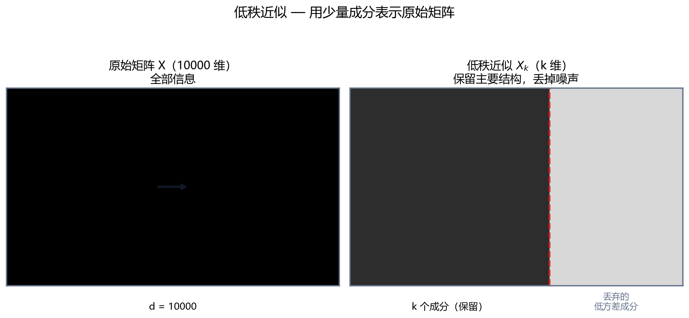

# 1.1.6 PCA 及低秩近似

> 属于：[[0-概述|线性代数]] > 1.1.6
> 掌握程度：**深入** — PCA 是降维、可视化、去噪、特征工程的通用工具，不只是异常检测

---

## PCA 本质上在做什么

你有一堆高维数据。PCA 问一个问题：

> **"沿着哪个方向看，数据的变化最大？"**

第一个主成分 = 方差最大的方向。第二个主成分 = 和第一个正交的方向里方差最大的。以此类推。

拿二维降到一维举例：



*图 1.1.6-1：蓝色散点为二维数据（沿 30° 方向拉长）。红色箭头 PC1 = 数据方差最大的方向，灰色细线为每个点到 PC1 的投影垂线；灰色虚线 PC2 与 PC1 正交。*

不是随便找条线投影——**找让投影后的数据尽可能分散的那条线。** 分散 = 方差大 = 信息保留得多。

---

## 数学步骤（和前面 SVD 接上）

对中心化后的数据矩阵 $\tilde{\mathbf{X}} \in \mathbb{R}^{n \times d}$（$n$ 个样本，$d$ 个特征）：

**方法一：协方差 + 特征分解**

$$\mathbf{\Sigma} = \frac{1}{n-1}\tilde{\mathbf{X}}^\top\tilde{\mathbf{X}}, \quad \mathbf{\Sigma}\mathbf{v}_i = \lambda_i \mathbf{v}_i$$

取前 $k$ 个最大特征值对应的特征向量 $\mathbf{V}_k = [\mathbf{v}_1, \dots, \mathbf{v}_k]$。

**方法二：直接 SVD（数值更稳定）**

$$\tilde{\mathbf{X}} = \mathbf{U}\mathbf{\Sigma}\mathbf{V}^\top$$

取 $\mathbf{V}$ 的前 $k$ 列作为主成分。两种方法等价。

**投影（降维）**：$\mathbf{Z} = \tilde{\mathbf{X}}\mathbf{V}_k \in \mathbb{R}^{n \times k}$
**重建**：$\hat{\mathbf{X}} = \mathbf{Z}\mathbf{V}_k^\top \in \mathbb{R}^{n \times d}$

---

## PCA 的五大应用场景

### 1. 降维 — 减少特征数量

**问题**：10000 个特征，但很多是冗余的（前面 [[1.1.3 线性相关、秩、基与子空间|1.1.3]] 说了：像素之间高度线性相关）。

**PCA 做法**：10000 维 → 50 维，保留 95% 的信息。

$$\frac{\sum_{i=1}^k \lambda_i}{\sum_{i=1}^d \lambda_i} \geq 0.95 \quad \Rightarrow \quad k \approx 50$$

然后拿这 50 维新特征替代原来的 10000 维，去做分类、回归、聚类——**后面的模型跑得更快、更不容易过拟合。**

这就是"用 PCA 做特征工程"。

### 2. 可视化 — 把人看不懂的高维数据画出来

你有 1000 个样本，每个 512 维特征向量。人没法看。

PCA → 512 维降到 2 维 → 画散点图：



*图 1.1.6-2：20 维特征（2 个信号维 + 18 个噪声维）PCA 降至 2 维。三类样本（正常/异常A/异常B）在 PC1-PC2 平面上清晰分离，轴标签给出各主成分解释方差比例。*

一眼看出：三类能不能分开，有没有离群点，数据是不是一坨混在一起。**这是每个深度学习工程师拿到新数据后做的第一件事。**

> t-SNE 和 UMAP 是非线性替代，更适合可视化局部结构，但不能像 PCA 那样有一个确定的投影矩阵。

### 3. 去噪 — 扔掉噪声维度

数据 = 信号 + 噪声。信号通常集中在前面几个大方差的主成分上，噪声分散在所有维度上。

```
保留前 k 个主成分重建 → 信号保留，噪声被丢弃
```

图像去噪、信号降噪的经典做法。PCA 假设信号方差大、噪声方差小且均匀分布——这个假设在很多场景成立。

### 4. 特征去相关 — 让特征之间独立

原始特征之间往往有相关性（温度 ↑ → 梯度 ↑），这对某些模型（如线性回归）不友好。

PCA 之后的主成分**互相正交（完全不相关）**。作为下游模型的输入，可以改善数值稳定性和收敛速度。

### 5. 异常检测 — 重建残差法

这是前面提到的应用。PCA 学习正常数据的子空间：

$$\text{异常分数} = \|\mathbf{x} - \hat{\mathbf{x}}\|_2 = \|\mathbf{x} - \mathbf{V}_k\mathbf{V}_k^\top\mathbf{x}\|_2$$

正常样本落在子空间内 → 重建误差小；异常样本偏离 → 重建误差大。

但这不是 PCA 唯一的能力，甚至不是它最主要的用途。PCA 最常见的身份是**通用降维工具**。

---

## PCA 的局限性（知道什么场景不该用）

| 局限 | 说明 | 替代 |
|---|---|---|
| **只捕获线性关系** | 数据沿曲线分布时 PCA 方向没意义 | Kernel PCA、自编码器 |
| **对方差敏感** | 必须标准化，否则绝对值大的特征会劫持主成分 | 先归一化再 PCA |
| **主成分可解释性差** | PC1 = 0.3×温度 + 0.1×梯度 + ... 每个都是组合，物理含义模糊 | 如果可解释性重要，用特征选择而非特征变换 |
| **假设全局线性子空间** | 不同类别的数据可能有不同的子空间 | 按类别分组做 PCA 或用非线性方法 |
| **正交约束** | 主成分互相正交，但在某些数据中"好方向"不一定正交 | ICA（独立成分分析） |

---

## 低秩近似

PCA 重建 $\hat{\mathbf{X}} = \mathbf{Z}\mathbf{V}_k^\top$ 本质上就是 SVD 的低秩近似。形式上：

$$\tilde{\mathbf{X}}_k = \sum_{i=1}^{k} \sigma_i \mathbf{u}_i \mathbf{v}_i^\top$$

这是 Eckart–Young 定理保证的：在**所有秩为 $k$ 的矩阵中，这个近似在 Frobenius 范数意义下是最优的。**



*图 1.1.6-3：左为原始矩阵（全部信息），右为低秩近似——深色块是保留的 k 个成分（主要结构），浅色块是被丢弃的低方差成分（噪声）。*

这个思想不止用在 PCA，也是 **LoRA 大模型微调**的数学基础——权重更新矩阵可以用两个低秩矩阵的乘积近似，因为有效秩本来就不高。

---

## 延伸：PLSR（偏最小二乘回归）——"监督版的 PCA"

PLSR（Partial Least Squares Regression，**偏最小二乘回归**）是经典统计方法，**不是深度学习**。它处理"自变量多、样本少、自变量高度相关"的回归问题（典型如光谱分析：上千个波长响应、几十个样本）。

### 和 PCA 的关键区别

| | PCA | PLSR |
|---|---|---|
| 找什么方向 | X 自身**方差最大** | X 中**与 Y 最相关** |
| 是否看 Y | ❌ 无监督 | ✅ 有监督 |
| 提取的成分 | 主成分（PC） | 潜变量（LV） |
| 目标 | 保留最多 X 信息 | 保留 X 信息 + 预测 Y |

数学目标（找权重 w、c 使潜变量 t=Xw, u=Yc 协方差最大）：

$$\max_{w,c} \text{Cov}(Xw,\ Yc)$$

**直觉**：PCA 问"数据哪些方向变化最大"，PLSR 问"哪些方向既变化大、又和我要预测的东西有关"。PCA 可能提取出与 Y 无关的成分（浪费），PLSR 每个成分都直接服务预测。

### 迭代过程（NIPALS 算法）

```
1. 找 w₁ 使 X 与 Y 协方差最大 → 提取潜变量 t₁ = Xw₁
2. 用 t₁ 对 X、Y 做回归，去掉 t₁ 解释掉的部分（残差）
3. 在残差上重复，提取 t₂、t₃……
4. 用 k 个潜变量做回归
```

和 PCA 同样是**低秩/子空间方法**——把高维 X 投影到低维潜空间再回归。

### 与近亲对比

| 方法 | 提取成分时 | 特点 |
|---|---|---|
| **PCA** | 只看 X 方差 | 无监督，不保证成分对预测有用 |
| **PCR**（主成分回归） | 先 PCA 再回归 | 两步走，第一步不看 Y |
| **PLSR** | 同时看 X 方差 + 与 Y 相关 | 一步到位，成分直接服务预测 |

在深度学习语境中，PLSR 属于**传统统计基线**（与 PCA 同层），深度学习模型可看作它的非线性扩展。

---

## 实践要点

1. **先标准化**。如果温度范围 20–35°C，梯度范围 0–0.5，不标准化 → 温度主导所有主成分，梯度完全被忽略
2. **$k$ 怎么选**：看累积解释方差比例图，找到"拐点"；或者设定阈值（如 95%）
3. **PCA 之前先看数据**：如果各维度单位不同、量纲差距大，标准化是必须的
4. **训练集 fit，测试集只 transform**：主成分从训练集学，拿同一组 $\mathbf{V}_k$ 应用到测试集。在测试集上重新 fit 会数据泄漏

---

## 总结：PCA 不是什么"异常检测专用工具"

| 用途 | 场景举例 |
|---|---|
| **降维** | 10000 维图像特征 → 50 维，给下游分类器用 |
| **可视化** | 512 维特征向量 → 2 维散点图，一眼看数据分布 |
| **去噪** | 信号保留前 k 个成分重建，丢掉噪声维度 |
| **去相关** | 让特征之间正交，改善线性模型数值稳定性 |
| **压缩** | 低秩近似，用少量成分表示原始数据 |
| **异常检测** | 重建残差法——这只是 PCA 的一个应用，不是全部 |

---

- ← [[1.1.5 正定矩阵、协方差矩阵、求逆与伪逆|上一节：1.1.5 正定矩阵与协方差]]
- → [[../../00-概览/INDEX|返回导航]]
