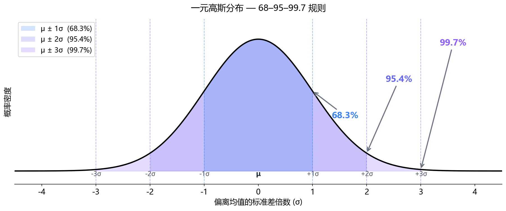
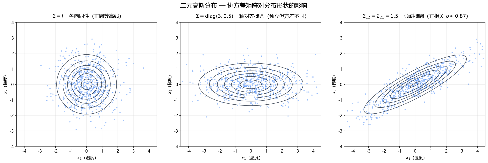
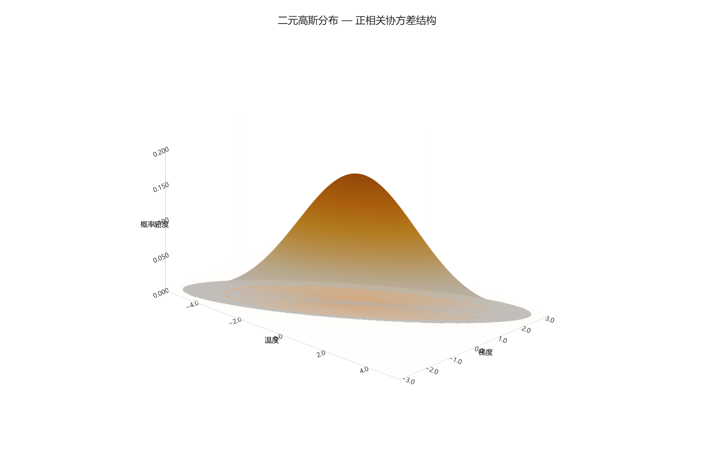

**本节内容**：高斯=正态：一元钟形曲线到多元椭圆分布，Σ 控制形状，68-95-99.7 规则。

> 属于：[[0-概述-概率统计|概率统计]] > 1.3.3
> 掌握程度：**深入** — 高斯分布是深度学习中最重要的概率分布

---

## 为什么高斯分布无处不在

**中心极限定理**：大量独立同分布随机变量的均值，近似服从高斯分布。

这意味着：测量误差、传感器噪声、批次间波动……大量自然现象的数据分布都接近高斯。深度学习中的很多假设（MSE 损失 ≈ 输出服从高斯；VAE 先验 = 标准高斯）的根源都在这里。

> **高斯分布 = 正态分布**，完全同一个东西。Gaussian distribution 以数学家高斯命名，Normal distribution 因为它太常见被称作"正态"。论文中两者混用，$\mathcal{N}(\mu, \sigma^2)$ 中的 $\mathcal{N}$ 是 Normal 的缩写。

---

## 一元高斯分布

### 概率密度函数

$$f(x) = \frac{1}{\sqrt{2\pi\sigma^2}} \exp\!\left(-\frac{(x-\mu)^2}{2\sigma^2}\right)$$

两个参数控制一切：
- $\mu$：均值，钟形曲线的中心位置
- $\sigma^2$：方差，钟形曲线有多"胖"（$\sigma$ 越大越分散）

### 标准化

$$z = \frac{x - \mu}{\sigma}$$

$z$ 服从标准正态 $\mathcal{N}(0, 1)$。这就是数据预处理中常用的 **Z-score 标准化**。

### 68-95-99.7 规则

*图 1.3.3-1：标准正态分布下 μ±σ / μ±2σ / μ±3σ 的概率覆盖面积。异常检测中的 3σ 阈值：超出 μ±3σ 范围的概率仅 0.3%。*

---

## 多元高斯分布

### 为什么要多元：一个特征不够

之前你只有"温度"一个特征，一元高斯足够。

现在你有两个特征——比如一个温度传感器的**温度**和它附近的**温度梯度**。它们是相关的（温度高的地方通常梯度也大）。如果分开独立建模，就丢失了这种关联信息，你会把"高温 + 高梯度"判成异常，但其实它是正常模式。

多元高斯同时描述多个特征的联合分布，**包括它们之间怎么关联**。

### 把两个特征放在一起看

拿温度（$x_1$）和梯度（$x_2$）两个特征，正常数据在二维平面上散开：

**情况一：两个特征独立，方差相同**

**情况二：两个特征独立，但方差不同**

**情况三：两个特征正相关——最常见的情况**

这三种情况对比如下：

*图 1.3.3-2：从左到右 — Σ=I（正圆）、Σ=diag(3,0.5)（轴对齐椭圆）、Σ₁₂=1.5（倾斜椭圆）。散点为随机采样，曲线为等概率密度等高线。*

情况三中，温度高的时候梯度通常也大，数据沿对角线分布。**协方差矩阵的非对角元捕获了这个"倾斜"**：

$$\mathbf{\Sigma} = \begin{bmatrix} \text{Var}(x_1) & \text{Cov}(x_1, x_2) \\ \text{Cov}(x_2, x_1) & \text{Var}(x_2) \end{bmatrix}$$

拿数值举例（温度方差 4.2，梯度方差 1.9，协方差 2.5）：

$$\mathbf{\Sigma} = \begin{bmatrix} 4.2 & 2.5 \\ 2.5 & 1.9 \end{bmatrix}$$

- 对角 4.2 和 1.9 = 各自的方差（沿坐标轴的散开程度）
- 非对角 2.5 = 协方差（正值 → 正相关 → 椭圆向右上方倾斜）

### 均值向量和协方差矩阵各自干什么

$$\mathbf{x} \sim \mathcal{N}(\boldsymbol{\mu}, \mathbf{\Sigma})$$

| | 一元 | 多元 | 控制什么 |
|---|---|---|---|
| 中心在哪 | $\mu$（一个数） | $\boldsymbol{\mu} = [\mu_1, \mu_2]^\top$ | 椭圆的中心位置 |
| 怎么散开 | $\sigma^2$（一个数） | $\mathbf{\Sigma}$（矩阵） | 椭圆的形状、大小、朝向 |

$\boldsymbol{\mu}$ 很简单，就是每个特征各自的均值凑成一个向量。**难点全在 $\mathbf{\Sigma}$。**

### 概率密度公式（不用怕）

$$f(\mathbf{x}) = \frac{1}{(2\pi)^{d/2} \det(\mathbf{\Sigma})^{1/2}} \exp\!\left(-\frac{1}{2} (\mathbf{x} - \boldsymbol{\mu})^\top \mathbf{\Sigma}^{-1} (\mathbf{x} - \boldsymbol{\mu})\right)$$

拆开看，和一元公式结构完全一样：

| | 一元 | 多元 |
|---|---|---|
| 归一化常数 | $\frac{1}{\sqrt{2\pi\sigma^2}}$ | $\frac{1}{(2\pi)^{d/2} \det(\mathbf{\Sigma})^{1/2}}$ |
| 指数里 | $-\frac{(x-\mu)^2}{2\sigma^2}$ | $-\frac{1}{2}(\mathbf{x}-\boldsymbol{\mu})^\top\mathbf{\Sigma}^{-1}(\mathbf{x}-\boldsymbol{\mu})$ |
| 距离度量 | $\frac{(x-\mu)}{\sigma}$ 倍标准差 | Mahalanobis 距离 |

指数里的部分 $(\mathbf{x}-\boldsymbol{\mu})^\top\mathbf{\Sigma}^{-1}(\mathbf{x}-\boldsymbol{\mu})$ 就是 Mahalanobis 距离的平方——在拉正后的空间里算欧氏距离。离中心这个距离越远 → 指数越小 → 概率密度越低。

**整个公式本质上就一句话**：多元高斯 = 在一元高斯的指数里，把"除以方差"替换成"乘以协方差的逆"，把一维距离换成多维 Mahalanobis 距离。

*图 1.3.3-3：Σ₁₂=1.5（正相关）的二元高斯 3D 曲面。底面投影了等高线，红色高亮标注。曲面呈倾斜的钟形——长轴沿 x₁=x₂ 对角线方向（正常变化方向），短轴垂直于对角线（异常方向）。*

### 在 DL 中

**VAE**：编码器为每个输入输出两组参数 $(\boldsymbol{\mu}, \boldsymbol{\sigma}^2)$——但实际用的是对角协方差（假设潜变量各维度独立），而非完整的 $\mathbf{\Sigma}$，因为完整协方差的参数量是 $O(d^2)$，对高维潜空间不现实。

**PaDiM**：为特征图的每个空间位置 $(h,w)$ 拟合一个完整的多元高斯。每个位置有自己的 $\boldsymbol{\mu}_{h,w}$ 和 $\mathbf{\Sigma}_{h,w}$。有波动的位置 $\mathbf{\Sigma}$ 特征值大（容忍度高），稳定的位置特征值小（严格）。这是 Mahalanobis 距离真正发光的地方，[[1.3.7 Mahalanobis距离与协方差收缩|1.3.7]] 详细展开。

**Diffusion**：前向加噪过程每一步是各向同性高斯（$\mathbf{\Sigma} = \beta_t \mathbf{I}$），各维度独立同方差。反向去噪也假设各向同性。

---

## 总结

| 分布 | 参数 | DL 中 |
|---|---|---|
| 一元高斯 | $\mu, \sigma^2$ | Z-score 标准化、$3\sigma$ 阈值 |
| 多元高斯 | $\boldsymbol{\mu}, \mathbf{\Sigma}$ | VAE 潜变量、PaDiM 位置建模 |

## 延伸：PDF 和 KDE 的关系

**PDF（概率密度函数）** 是分布的理论公式，比如高斯分布的 PDF 就是上面那个带 $\exp$ 的公式。你需要知道分布类型 + 参数（$\mu, \sigma$）才能写出 PDF。

**KDE（核密度估计）** 是在你不知道数据服从什么分布时，直接从数据样本反推 PDF 的方法。不假设分布类型（非参数）。

$$KDE: \quad \hat{f}(x) = \frac{1}{nh} \sum_{i=1}^{n} K\!\left(\frac{x - x_i}{h}\right)$$

直觉：在每个数据点放一个平滑的小山包（通常是高斯核函数），把所有山包叠起来归一化，就得到近似的 PDF。

| | PDF | KDE |
|---|---|---|
| 是什么 | 分布的理论公式 | 从样本估计 PDF 的方法 |
| 需要 | 知道分布类型 + 参数 | 只需要一堆数据点 |
| 假设 | 数据服从某已知分布 | 不做分布假设 |
| 控制参数 | $\mu, \sigma$（分布参数） | $h$ 带宽（山包宽度，决定平滑程度） |

在异常检测中，KDE 在 PCA 降维后的 latent 空间做非参数密度估计——不假设正常数据服从高斯，让数据自己"说话"。代价是计算量大（每个新样本要和所有训练样本算核函数）。
| 标准高斯 $\mathcal{N}(0,I)$ | 固定 | VAE 先验、Diffusion 噪声、参数初始化 |

---

- ← [[1.3.2 条件概率与贝叶斯公式|上一节：1.3.2 条件概率与贝叶斯]]
- → [[1.3.4 最大似然估计与最大后验估计|下一节：1.3.4 MLE 与 MAP]]
