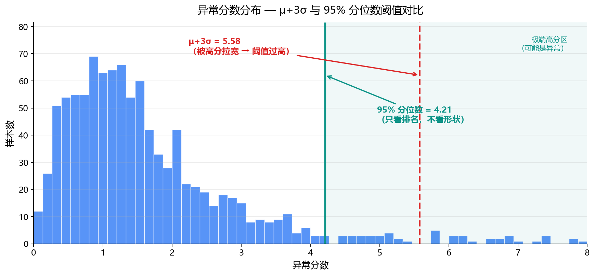
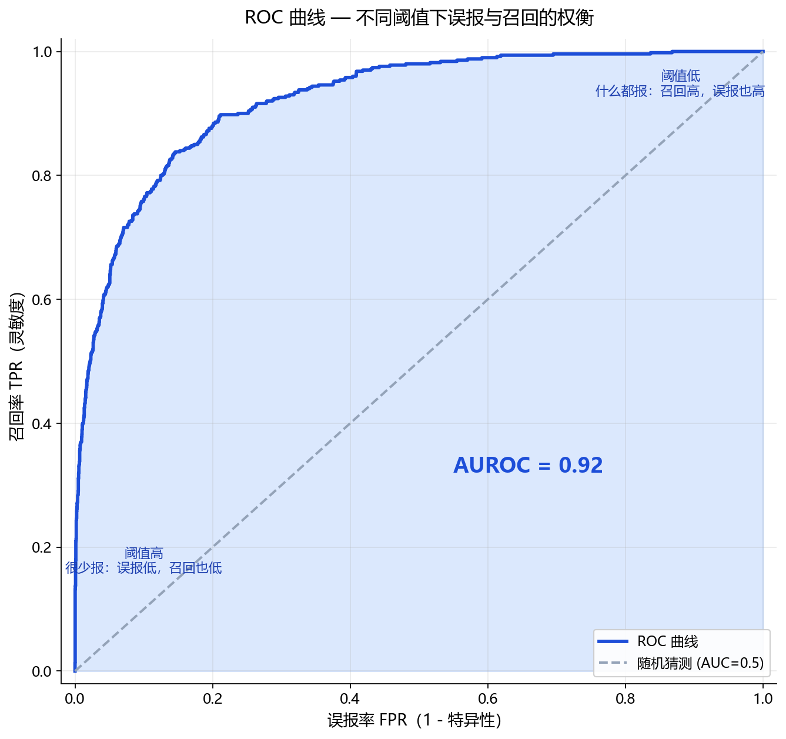

# 1.3.5 置信区间、分位数、假设检验

> 属于：[[0-概述|概率统计]] > 1.3.5
> 掌握程度：**会用** — 这是"怎么判断一个新样本算不算异常"和"模型指标可不可信"的统计依据

---

## 一个场景串起全部三个工具

你训练了一个异常检测模型，用 1000 张正常温度图跑出了 1000 个"异常分数"。现在有三个问题：

1. **"这个新样本分数 3.8，算异常吗？"** → 分位数（设定边界）
2. **"模型准确率 87.3%，这个数可不可信？"** → 置信区间（给出不确定性）
3. **"凭什么 3.8 就该判异常？"** → 假设检验（给出判定逻辑）

三个工具回答的是同一个核心问题：**统计上怎么划定"正常"和"异常"的边界，以及我们对边界的把握有多大。**

---

## 分位数 — "正常数据里的排名位置"

### 先看例子

你得到 1000 个正常样本的异常分数，从小到大排序：

```
分数：0.1, 0.2, 0.3, ..., 3.2, 3.5, 3.9, 5.8
                                     ↑
                       排在第 950 个的是 3.5（第 95% 分位数）
```

第 95% 分位数 = 3.5，意思是：**95% 的正常样本分数 ≤ 3.5，只有 5% 的正常样本超过它。**

新样本分数 3.8 > 3.5 → 它比 95% 的正常样本都高 → 判定为异常。

### 定义

$$P(X \leq q_\alpha) = \alpha$$

$q_{0.95}$ 就是"有 95% 的数据落在它之下的值"。

### 常用分位数

| 分位数 | 数值 | 用途 |
|---|---|---|
| 中位数 Median | 0.50 | 稳健的中心趋势（1.3.6 详讲） |
| 下四分位数 Q1 | 0.25 | 箱线图下边 |
| 上四分位数 Q3 | 0.75 | 箱线上边 |
| 95% 分位数 | 0.95 | 异常检测默认阈值 |
| 99% 分位数 | 0.99 | 严格阈值（允许 1% 正常样本被误报） |

### 为什么用分位数而不是均值/标准差

1.3.3 讲过的 $3\sigma$ 规则假设数据服从高斯分布。但异常分数往往不是高斯分布——右尾拖得很长（极少样本分数特别高）。



*图 1.3.5-1：右偏的异常分数分布。红色虚线 μ+3σ 被右尾高分拉宽，阈值过高容易漏报；青色实线 95% 分位数只看排名不看分布形状，阈值更贴近实际。*

- 用 $\mu + 3\sigma$ → 右尾的高分把 σ 拉大 → 阈值被抬得太高 → 漏报
- 用 95% 分位数 → 不假设分布形状，只看排名 → 阈值更贴近实际

### 一句话

> **分位数 = 不看分数绝对值多大，只看它排在正常数据的什么位置。超过第 95% 分位 → 比 95% 的正常样本都极端 → 异常。**

---

## 置信区间 — "估计值有多不确定"

### 先看例子

你想知道这个测温点的真实温度 θ。测了 100 次，得到均值 25.1°C、标准差 0.8°C。

直觉上：25.1 是 θ 的最佳估计，但 θ 不可能是精确的 25.1——再测 100 次均值会变。

**置信区间给这个不确定性一个量化的范围**：在 95% 置信水平下，

$$\bar{x} \pm 1.96 \times \frac{s}{\sqrt{n}} = 25.1 \pm 1.96 \times \frac{0.8}{10} = 25.1 \pm 0.157$$

**95% 置信区间 = [24.94, 25.26]**，意思是：真实温度 θ 落在 24.94~25.26 之间（95% 置信水平）。

> 这里 1.96 就是标准正态分布的 97.5% 分位数（1.3.3 的 68-95-99.7 表里 95% 对应 ±2σ，精确值是 ±1.96σ）——分位数和置信区间在这里接上了。

### 最关键的误解澄清

**"真实温度 θ 有 95% 概率落在 [24.94, 25.26] 里"——这是错的。**

θ 是固定不变的物理量，要么在区间里（100%），要么不在（0%），没有"95% 概率"一说。

正确的理解：

> **区间是随机的，θ 是固定的。重复做 100 次实验，每次得到不同的区间，大约 95 个区间会套住 θ。**

```
θ 的真实值 ─────────●──────────────────
                    │
  实验1 区间：[24.94, 25.26]  ✅ 套住了
  实验2 区间：[24.80, 25.12]  ✅ 套住了
  实验3 区间：[25.30, 25.62]  ❌ 没套住（5% 里的一次）
  实验4 区间：[24.91, 25.23]  ✅ 套住了
  ...
  实验100 区间：[24.87, 25.19] ✅ 套住了
  （约 95 个 ✅，约 5 个 ❌）
```

### 什么影响区间宽度

| 因素 | 变化 | 区间 |
|---|---|---|
| 样本量 n | 大 | 窄（更精确） |
| 数据波动 s | 大 | 宽（更不确定） |
| 置信水平 | 95% → 99% | 更宽（更保守） |

样本量影响最大：$\frac{s}{\sqrt{n}}$ 里 n 开根号。样本从 100 增到 10000，区间宽度缩到原来的 1/10。

### 在深度学习中

**评估模型性能必须报不确定性。** 用不同随机种子跑同一个模型 5~10 次：

```
种子1: 87.1%  种子2: 86.8%  种子3: 88.2%  种子4: 87.4%  种子5: 87.0%
              → 均值 87.3%，标准差 0.55%
              → 95% CI ≈ 87.3% ± 0.48%
```

两个模型准确率 87.3% vs 87.5%——如果不报置信区间，看不出 0.2% 的差距完全在噪声范围内。**报告指标不带置信区间 = 报告一个没有可信度的数字。**

---

## 假设检验 — "判定异常的完整逻辑"

### 先看例子：法庭判案

异常检测的判定本质上和法庭判案同构：

| 法庭 | 异常检测 |
|---|---|
| 假设被告无罪（默认立场） | 假设样本正常（默认立场） |
| 只有证据足够强才判有罪 | 只有分数足够极端才判异常 |
| 证据不足 → 无罪释放 | 分数不高 → 判正常 |
| 冤枉好人 | 误报（正常判成异常） |
| 放走坏人 | 漏报（异常判成正常） |

**"默认无罪"这个设定是关键**——没有足够证据不能定罪，宁可放走也不要冤枉。异常检测里默认"正常"，宁可漏过也不乱报。

### 正式框架

| 术语 | 符号 | 含义 |
|---|---|---|
| 零假设 | $H_0$ | 默认立场：样本正常 |
| 备择假设 | $H_1$ | 对立立场：样本异常 |
| 显著性水平 | $\alpha$ | 允许冤枉好人的概率上限（通常 0.05） |
| $p$ 值 | — | 在样本真的正常的前提下，看到这么极端分数的概率 |

**判定规则**：$p$ 值 < $\alpha$ → 拒绝 $H_0$（判异常）；否则 → 无法拒绝 $H_0$（判正常）。

### p 值是什么——一个具体数字例子

你得到新样本分数 3.8。假设"样本正常"（$H_0$）成立，观察正常样本的分数分布：

- 正常样本里，分数 ≥ 3.8 的比例只有 0.8% → $p$ 值 = 0.008
- $\alpha = 0.05$，$p = 0.008 < 0.05$ → 拒绝 $H_0$ → **判异常**

$p$ 值越小，说明"正常样本会出现这么极端的分数"越难以置信 → 越有理由判异常。这就是为什么 p 值小才拒绝 H0——**小概率事件发生了，说明默认假设可能有问题。**

### 两类错误——异常检测的误报和漏报

| | 实际正常 | 实际异常 |
|---|---|---|
| **判正常** | ✅ 正确 | ❌ **第二类错误 = 漏报**（代价：缺陷流出） |
| **判异常** | ❌ **第一类错误 = 误报**（代价：产线停机） | ✅ 正确 |

这里和 1.3.5 之前的统计概念完全对应：

| 统计概念 | 异常检测对应 | 工业现场关心的问题 |
|---|---|---|
| $\alpha$（第一类错误率） | 误报率 FPR | "每万件产品误报几件？" |
| $\beta$（第二类错误率） | 漏报率 FNR | "最小缺陷能不能抓住？" |
| $1 - \beta$ | 召回率 Recall | 检出能力 |

**为什么这两类错误的代价不对称**：误报最多浪费一次检查，漏报可能让整批缺陷产品流向客户。所以工业场景的阈值通常往"严格"方向调（宁可多误报，不可漏报）。

### AUROC 和假设检验的关系

AUROC = 遍历所有可能的阈值，画出"误报率 vs 召回率"的权衡曲线下的面积。



*图 1.3.5-2：正常分数 ~N(0,1)、异常分数 ~N(2,1) 的模拟 ROC 曲线。蓝色曲线下的面积即 AUROC（=0.92）；灰色虚线为随机猜测基线（AUC=0.5）。阈值低时曲线走向右上（什么都报），阈值高时走向左下（很少报）。*

**AUROC 本质上就是"不管阈值怎么定，这个模型区分正常和异常的能力有多强"**——它评价的是模型本身，和具体阈值无关。而假设检验给出了"阈值应该怎么定"的逻辑。

---

## 三个工具怎么配合用

```
1. 训练 → 收集正常样本的分数分布
         ↓
2. 分位数 → 选一个初始阈值（比如 95% 分位数）
         ↓
3. 假设检验 → 明确"误报"和"漏报"的代价，调整阈值
             （误报贵 → 阈值上调；漏报贵 → 阈值下调）
         ↓
4. 置信区间 → 报告模型的准确率/召回率时带上不确定性
             （否则无法判断两个模型的差距是真差距还是噪声）
```

## 总结

| 工具 | 回答什么问题 | 一句话 |
|---|---|---|
| **分位数** | 新样本分数排第几？ | 超过 95% 分位 → 异常 |
| **置信区间** | 估计值有多不确定？ | 区间是随机的，θ 是固定的，95% 的区间会套住 θ |
| **假设检验** | 判定逻辑是什么？ | 默认正常，证据足够极端才判异常，$p$ 值 < $\alpha$ → 拒绝 $H_0$ |
| **两类错误** | 误报和漏报怎么权衡？ | $\alpha$ = 误报率，$\beta$ = 漏报率，工业场景漏报代价通常更高 |

---

- ← [[1.3.4 最大似然估计与最大后验估计|上一节：1.3.4 MLE 与 MAP]]
- → [[1.3.6 稳健统计|下一节：1.3.6 稳健统计]]
