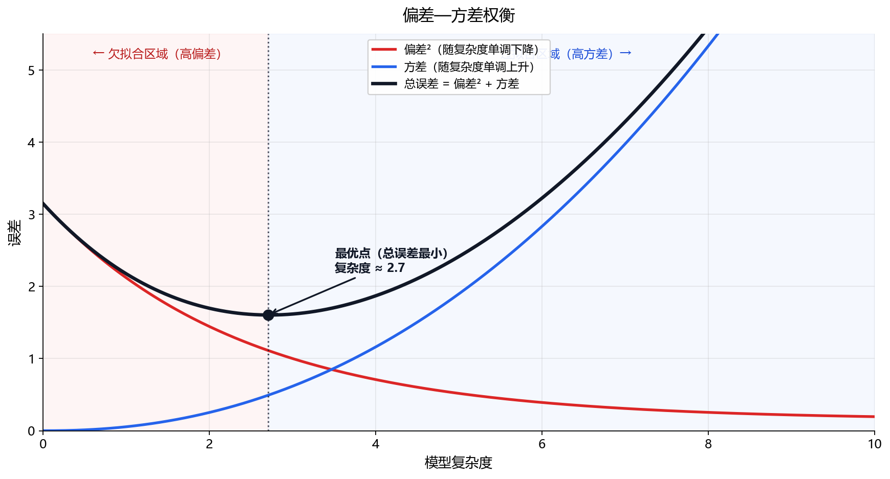
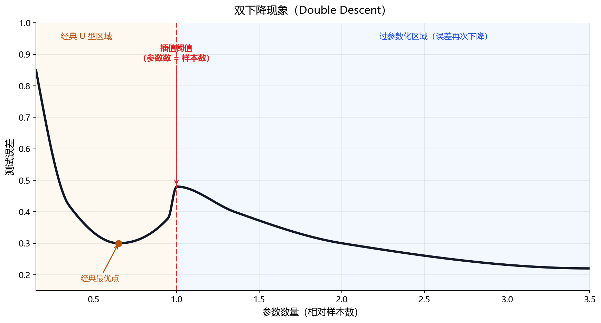

# 1.3.8 偏差—方差权衡

> 属于：[[0-概述|概率统计]] > 1.3.8
> 掌握程度：**深入** — 这是理解过拟合/欠拟合、选择模型复杂度的统一框架

---

## 问题的根源

模型的测试误差可以分解为三个来源：

$$\mathbb{E}[(y - \hat{f}(x))^2] = \underbrace{\text{Bias}[\hat{f}(x)]^2}_{\text{偏差}^2} + \underbrace{\text{Var}[\hat{f}(x)]}_{\text{方差}} + \underbrace{\sigma^2_{\varepsilon}}_{\text{不可约误差}}$$

### 三项各自的含义

| 项 | 含义 | 来源 |
|---|---|---|
| $\text{Bias}^2$ | 模型平均预测与真实值的差距 | 模型太简单，欠拟合 |
| $\text{Var}$ | 换一组训练数据，预测变化多大 | 模型太复杂，对数据噪声敏感 |
| $\sigma^2_\varepsilon$ | 数据本身的噪声 | 无法通过改模型减少 |

### 偏差和方差不能同时降低

*图 1.3.8-1：红色曲线偏差²随复杂度单调下降，蓝色曲线方差单调上升，黑色总误差呈 U 型。左侧浅红区为欠拟合（高偏差），右侧浅蓝区为过拟合（高方差），黑色虚线处总误差最小。*

- **低复杂度**：偏差高（模型太笨，学不到真实规律），方差低（换数据不动）
- **高复杂度**：偏差低（模型聪明，能拟合复杂关系），方差高（换一组数据预测大变）
- **最优点在中间**：偏差和方差交叉的地方

---

## 深度学习中的偏差—方差

### 过拟合 = 低偏差 + 高方差

模型记住了训练数据的具体噪声模式而非一般规律。训练误差极低，验证误差高。

**诊断信号**：训练损失在降，验证损失不降反升。

**应对**：正则化（L1/L2/Dropout）、早停、数据增强、降低模型容量。

### 欠拟合 = 高偏差 + 低方差

模型连训练数据的基本结构都学不到。训练和验证误差都高。

**诊断信号**：训练损失和验证损失都高，且差距不大。

**应对**：增加模型容量、减少正则化、训练更久、加特征。

### 双下降现象

现代深度学习发现了一个反直觉的现象：参数数量超过训练样本数后，测试误差**再次下降**。

*图 1.3.8-2：左半（琥珀背景）是经典 U 型：误差先降后升，到"插值阈值"（参数数 = 样本数，红色虚线）处达到峰值；右半（蓝色背景）过参数化区域，误差再次下降。*

这突破了传统的偏差—方差 U 型曲线，但仍未完全解释清楚。这是当前 DL 理论活跃的研究方向。

---

## 这一框架的实际价值

### 指导模型选择

| 现象 | 诊断 | 解决方向 |
|---|---|---|
| 训练误差高 + 验证误差高 | 欠拟合（高偏差） | 加容量、减正则化 |
| 训练误差低 + 验证误差高 | 过拟合（高方差） | 加正则化、加数据、早停 |
| 训练误差低 + 验证误差低 | 刚好 | 保持 |

### 指导样本量需求

方差随样本量增大而减小（数据多 → 不同训练集的结果趋于一致）。偏差不受样本量直接影响。"更多数据"帮助的是高方差场景（过拟合），对高偏差场景（模型本身太简单）帮助有限。

---

## 总结

| 概念 | 一句话 |
|---|---|
| 偏差 | 模型平均来说对不对？ |
| 方差 | 模型在不同训练集上稳不稳？ |
| 偏差—方差分解 | 测试误差 = 偏差² + 方差 + 噪声 |
| 欠拟合 | 高偏差低方差 → 加大模型 |
| 过拟合 | 低偏差高方差 → 正则化/加数据 |
| 不可约误差 | 数据本身的噪声，模型再好也无解 |

---

- ← [[1.3.7 Mahalanobis距离与协方差收缩|上一节：1.3.7 Mahalanobis 与收缩]]
- → [[0-概述|返回概率统计概述]]
