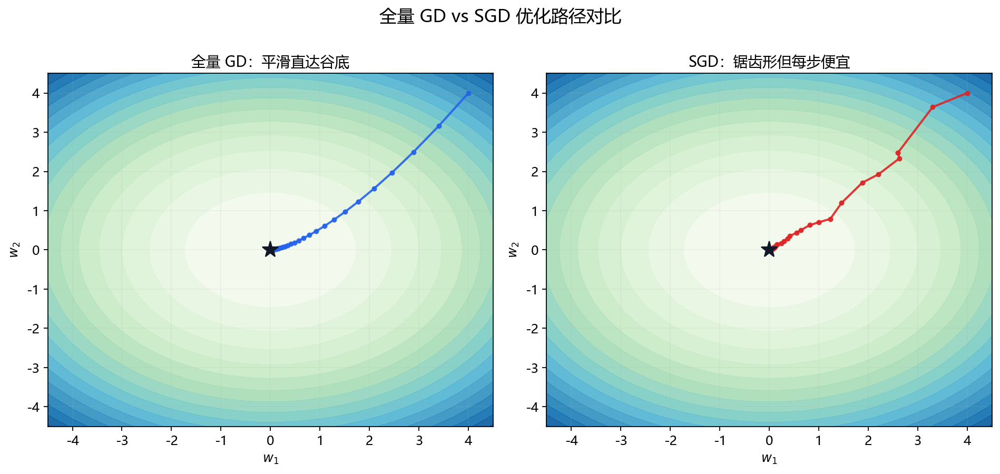
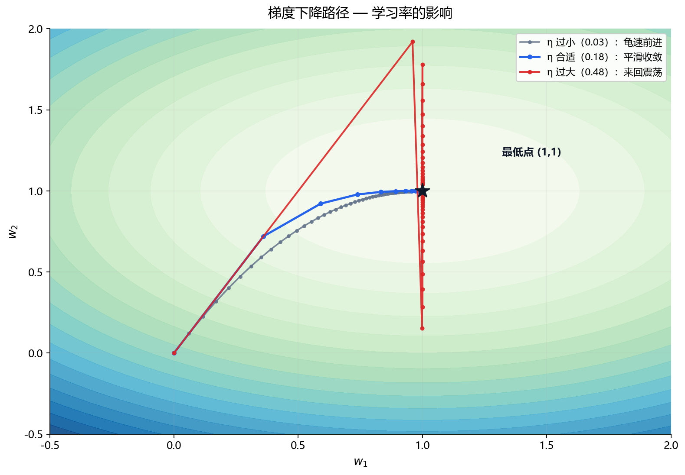

# 1.4.1 梯度下降与随机梯度下降

> 属于：[[0-概述|优化]] > 1.4.1
> 掌握程度：**深入** — 所有神经网络训练的基础算法

---

## 先看一个例子：雾天里下山

你被放在一座山的山顶，大雾看不见全貌，只能感觉到**脚下**的坡度。要走到谷底，策略只有一个：

> 每一步都往"脚下最陡的下坡方向"迈。

这就是梯度下降。局部信息（当前点的坡度）驱动全局目标（到达谷底）。

在深度学习中，山 = 损失函数 $L(\theta)$，你的位置 = 参数 $\theta$，脚下坡度 = 梯度 $\nabla L(\theta)$。

---

## 梯度下降公式

$$w_{t+1} = w_t - \eta \nabla L(w_t)$$

- $w_t$ = 当前参数
- $\nabla L(w_t)$ = 当前点的梯度（指向上升最快的方向，所以取负号）
- $\eta$（学习率）= 步长，迈多大

### 为什么是"减"梯度

[[../1.2-微积分/1.2.1 导数、偏导数、方向导数与梯度|1.2.1]] 讲过：梯度指向函数**增长最快**的方向。我们要让损失**下降**，所以往反方向走——减。

### 一个具体的数字例子

损失 $L(w) = (w - 3)^2$（最简单的一维碗）。用梯度下降找最小值：

| 步骤 | 当前 w | 梯度 $\nabla L = 2(w-3)$ | 更新（η=0.1） |
|---|---|---|---|
| 0 | 0.0 | -6.0 | w = 0.6 |
| 1 | 0.6 | -4.8 | w = 1.08 |
| 2 | 1.08 | -3.84 | w = 1.464 |
| 3 | 1.464 | -3.07 | w = 1.77 |
| ... | ... | ... | 越来越接近 3 |

每步梯度变小（因为越来越靠近谷底），最后收敛到 w=3。**手算一次就知道梯度下降在干什么了。**

---

## 三种变体：全量 / 小批量 / 随机

损失是对所有样本的平均。每次更新用多少个样本算梯度，有三种选择：

| 变体 | 每步用多少样本 | 特点 |
|---|---|---|
| **GD（梯度下降）** | 全部 n 个 | 方向准，但每步要算 n 次，慢；大数据集不可行 |
| **SGD（随机梯度下降）** | 1 个 | 每步便宜，但方向噪声大，路径震荡 |
| **Mini-batch SGD** | 一小批（如 32/64/128） | 折中——**实际训练默认用这个** |



*图 1.4.1-1：同一碗形损失曲面的俯视图。左：全量 GD 用全部样本算梯度，路径平滑直达谷底；右：SGD 每次只用一个样本，梯度带噪声，路径锯齿形但每步计算便宜。*

PyTorch 中的"优化器"默认就是 Mini-batch SGD 的机制：

```python
optimizer = torch.optim.SGD(model.parameters(), lr=0.01)

for batch in dataloader:        # DataLoader 自动切小批量
    loss = compute_loss(batch)
    optimizer.zero_grad()
    loss.backward()             # 算这个小批量的梯度
    optimizer.step()            # w = w - η·∇L
```

### 为什么小批量反而好

- 批内噪声（随机性）帮助跳出不好的局部极小
- GPU 能并行算一批，1 个样本和 128 个样本耗时差别不大
- 大批量 → 梯度更平滑但需要更大学习率（有理论关联）

---

## 收敛直觉：学习率的影响

$$\eta \text{ 太大} \rightarrow \text{跨过谷底来回震荡，不收敛}$$
$$\eta \text{ 太小} \rightarrow \text{走得太慢，半天到不了谷底}$$



*图 1.4.1-2：同一个碗形损失曲面上三种学习率的下降路径。η 过小：龟速接近谷底；η 合适：平滑收敛；η 过大：跨过谷底来回震荡。*

学习率怎么选、什么时候调小，在 [[1.4.3 学习率、学习率调度与权重衰减|1.4.3]] 展开。

---

## 总结

| 概念 | 一句话 |
|---|---|
| 梯度下降 | 每一步往脚下最陡的下坡方向走 |
| 更新公式 | $w \leftarrow w - \eta \nabla L(w)$ |
| GD / SGD / Mini-batch | 全量 / 单个 / 小批 折中，**训练默认 Mini-batch** |
| 学习率 η | 步长——太大震荡，太小龟速 |

> 梯度下降 = 雾天里用脚下坡度找谷底。深度学习训练的一切（Momentum、Adam、学习率调度）都是在这个基本动作上做改进。

---

- ← [[0-概述|优化概述]]
- → [[1.4.2 Momentum、Adam、AdamW|下一节：1.4.2 Momentum 与 Adam]]
