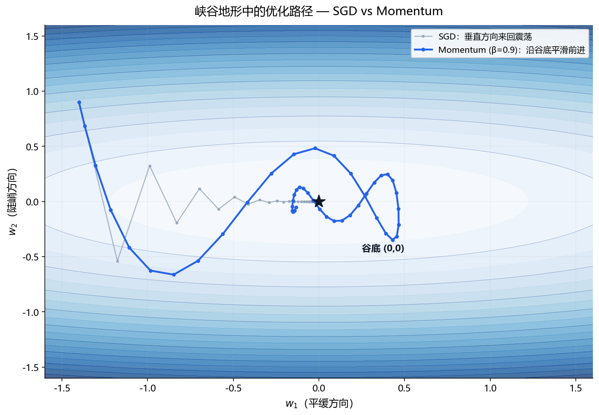

**本节内容**：Momentum 加惯性、Adam 加自适应步长、AdamW 修好权重衰减——炼丹默认。

> 属于：[[0-概述-优化|优化]] > 1.4.2
> 掌握程度：**会用** — PyTorch 里的默认配置

---

## 问题：朴素梯度下降的毛病

[[1.4.1 梯度下降与随机梯度下降|1.4.1]] 的"脚下坡度"策略有两个问题：

1. **震荡**：峡谷地形中来回摆动（垂直于谷底的方向来回跳，沿谷底的方向走不动）
2. **没有记忆**：每一步都只看脚下，没有"之前一直在往某个方向走"的惯性

Momentum 和 Adam 就是为了解决这两点。

---

## Momentum

带惯性下山。

### 直觉

从山顶推一个球下去。球不是每一步都重新决定方向——它带着**之前的动量**，遇到小坑会冲过去，方向也自然平滑。

### 公式

$$v_t = \beta v_{t-1} + (1 - \beta) \nabla L(w_t)$$
$$w_{t+1} = w_t - \eta v_t$$

- $v_t$ = 速度（历史梯度的指数加权平均）
- $\beta$ = 动量系数，通常 0.9——**保留 90% 旧速度，加入 10% 新梯度**

### 效果



*图 1.4.2-1：峡谷形损失曲面（w₂ 方向陡峭、w₁ 方向平缓），同一出发点。灰色虚线 SGD 在陡峭方向来回震荡、前进缓慢；蓝色实线 Momentum 靠惯性压制震荡，沿谷底平滑直达谷底（星号）。*

---

## Adam

每个参数有自己的步长。

### 直觉

SGD 对**所有参数用同一个学习率**。但不同参数的情况不同：有的参数梯度一直很大（陡峭），有的很小（平缓）。

Adam = **Momentum + 逐参数自适应步长**：

> 梯度大的参数自动迈小步（怕震荡），梯度小的参数自动迈大步（怕走不动）。

### 公式（关键思想，不背细节）

$$m_t = \beta_1 m_{t-1} + (1-\beta_1) g_t \quad \text{（一阶矩 = 动量）}$$
$$v_t = \beta_2 v_{t-1} + (1-\beta_2) g_t^2 \quad \text{（二阶矩 = 梯度大小估计）}$$
$$w_{t+1} = w_t - \eta \frac{\hat{m}_t}{\sqrt{\hat{v}_t} + \epsilon}$$

- $g_t$ = 第 t 步的梯度
- $\frac{\hat{m}_t}{\sqrt{\hat{v}_t}}$ = **归一化的步长**：梯度大 → $\sqrt{\hat{v}_t}$ 大 → 步长自动变小

### 默认超参数（几乎不用调）

| 参数 | 默认值 | 含义 |
|---|---|---|
| $\beta_1$ | 0.9 | 动量衰减 |
| $\beta_2$ | 0.999 | 步长估计衰减 |
| $\eta$ | 0.001 | 学习率 |

### 为什么 Adam 是"炼丹默认"

- 几乎不需要调学习率（0.001 一般都能工作）
- 对噪声、稀疏梯度稳健
- 训练前期收敛快

---

## AdamW

修正版 Adam。

### Adam 的一个隐蔽问题

Adam 的权重衰减（L2 正则）实现方式不正确——正则项混在梯度里被自适应步长缩放，导致 L2 的实际效果变弱且不稳定。

**AdamW（Adam with Weight Decay）**：把权重衰减从梯度里**解耦**出来，单独做：

$$\text{Adam 的更新} \quad + \quad w \leftarrow w - \eta \lambda w \quad \text{（直接衰减权重）}$$

### 为什么重要

- 大量实验证明 AdamW 的泛化性能稳定优于 Adam
- **现代预训练模型（Transformer、LLM）的默认优化器就是 AdamW**
- 对应关系：权重衰减 = L2 正则 = 高斯先验下的 MAP（见 [[1.3.4 最大似然估计与最大后验估计|1.3.4]]）

```python
# PyTorch 用法
optimizer = torch.optim.AdamW(model.parameters(), lr=1e-3, weight_decay=0.01)
```

---

## 对比总结

| 优化器 | 惯性 | 自适应步长 | 权重衰减 | 典型场景 |
|---|---|---|---|---|
| **SGD** | ❌ | ❌ | 混在梯度中 | 简单任务、CV 微调 |
| **Momentum** | ✅ | ❌ | 混在梯度中 | 比 SGD 快且稳 |
| **Adam** | ✅ | ✅ | 实现有缺陷 | 快速原型、RNN/Transformer |
| **AdamW** | ✅ | ✅ | ✅ 解耦正确 | **现代默认**（LLM/Transformer） |

> 记忆口诀：Momentum 加惯性，Adam 加自适应步长，AdamW 修好了 Adam 的权重衰减。

---

- ← [[1.4.1 梯度下降与随机梯度下降|上一节：1.4.1 梯度下降]]
- → [[1.4.3 学习率、学习率调度与权重衰减|下一节：1.4.3 学习率与调度]]
