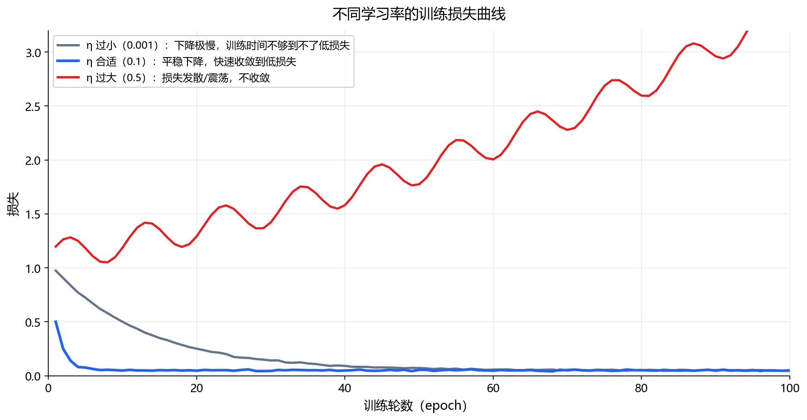
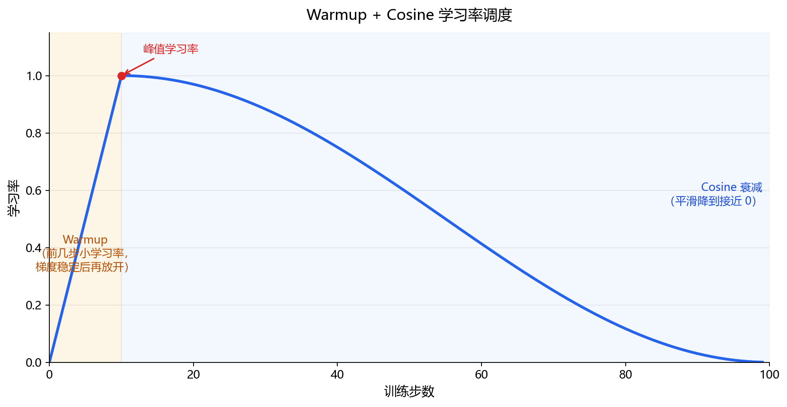

**本节内容**：学习率是训练里最重要的超参数：调度器先大步后小步，权重衰减=L2 正则。

> 属于：[[0-概述-优化|优化]] > 1.4.3
> 掌握程度：**会用** — 训练中最常调的参数

---

## 学习率：训练里最重要的超参数

[[1.4.1 梯度下降与随机梯度下降|1.4.1]] 讲过：$\eta$ 太大震荡、太小龟速。实际训练中，**学习率往往比模型结构更影响最终效果**——调参第一件事就是看学习率。



*图 1.4.3-1：同一模型三种学习率的训练损失曲线。η 过大：损失发散/震荡不收敛（红色）；η 合适：平稳下降收敛到低损失（蓝色）；η 过小：下降极慢，训练时间不够就到不了低损失（灰色）。*

### 判断信号

| 现象 | 学习率状态 |
|---|---|
| 损失发散（NaN/暴涨） | 太大，减小 10 倍 |
| 损失缓慢波动不下降 | 偏大 |
| 损失下降很慢 | 太小，增大 10 倍 |
| 损失平滑下降后平台 | 合适，等调度器调小 |

---

## 学习率调度：先大步后小步

训练后期接近谷底时，需要**更小的步长**精确定位。调度器（scheduler）自动调小学习率：

| 调度器 | 行为 | 适用 |
|---|---|---|
| **Step Decay** | 每 N 个 epoch 学习率乘 0.1 | 经典 CNN |
| **Cosine** | 沿余弦曲线平滑降到 0 | Transformer、现代默认 |
| **Warmup** | 前几步从小学习率快速升到目标值 | 大模型/大 batch 必用 |

### 为什么需要 Warmup

训练初期参数是随机的，梯度很大且方向乱。一开始就用大学习率容易把参数"踢飞"。先小步走几步让梯度稳定，再放开大步。



*图 1.4.3-2：橙色区域为 Warmup——学习率从 0 线性升到峰值（红色圆点）；蓝色区域为 **Cosine 退火**——从峰值平滑降到接近 0。大模型训练的标准配置。*

> **Warmup 不是退火，是两段不同的调度**：Warmup 在训练开头把学习率从 0 **升**到峰值（防止初期梯度乱踢飞参数）；**退火**泛指学习率随时间**下降**的策略，Cosine 退火只是其中一种（还有 Step 退火、指数退火）。两者一升一降、首尾相接，常组合使用（上图就是组合），但各自独立、方向相反。

```python
# PyTorch：Cosine + Warmup 组合（Transformer 训练的标准配置）
scheduler = torch.optim.lr_scheduler.CosineAnnealingLR(
    optimizer, T_max=epochs)
```

---

## 权重衰减

Weight Decay = L2 正则化。

### 它是什么

每次更新后，把权重往 0 方向**额外拉一点点**：

$$w \leftarrow w - \eta \nabla L(w) - \eta \lambda w$$

### 它为什么有效（连接 [[1.3.4 最大似然估计与最大后验估计|1.3.4]]）

[[1.3.4 最大似然估计与最大后验估计|1.3.4]] 讲过：L2 正则 = 高斯先验下的 MAP。权重衰减是**同一件事的工程实现**——每次更新都强制权重变小，等效于"参数假设服从以 0 为中心的高斯分布"。

### 和 L1 的区别（几何直觉在 [[1.4.5 约束与正则化（L1与L2）|1.4.5]] 展开）

| | L2（权重衰减） | L1 |
|---|---|---|
| 更新效果 | 权重等比缩小（接近 0 但很少为 0） | 权重被压到精确的 0 |
| 结果 | 小权重、防止过拟合 | **稀疏**权重、特征选择 |
| DL 用法 | 默认正则化 | 少见（稀疏性需求时） |

### 典型值

- AdamW：`weight_decay=0.01`（默认）
- SGD：`weight_decay=5e-4`（经典 CNN 配置）

---

## 总结

| 工具 | 一句话 |
|---|---|
| 学习率 η | 最重要的超参数——太大震荡、太小龟速 |
| 调度器 | 训练后期自动调小步长（Step/Cosine/Warmup） |
| Warmup | 大模型必用：先小步稳定再大步 |
| 权重衰减 | 每次更新把权重拉向 0 = L2 正则 = MAP 高斯先验 |

> 调参顺序建议：先定学习率（发散就除 10，龟速就乘 10），再加调度器，最后调权重衰减。

---

- ← [[1.4.2 Momentum、Adam、AdamW|上一节：1.4.2 Momentum 与 Adam]]
- → [[1.4.4 凸优化与非凸优化|下一节：1.4.4 凸优化与非凸优化]]
