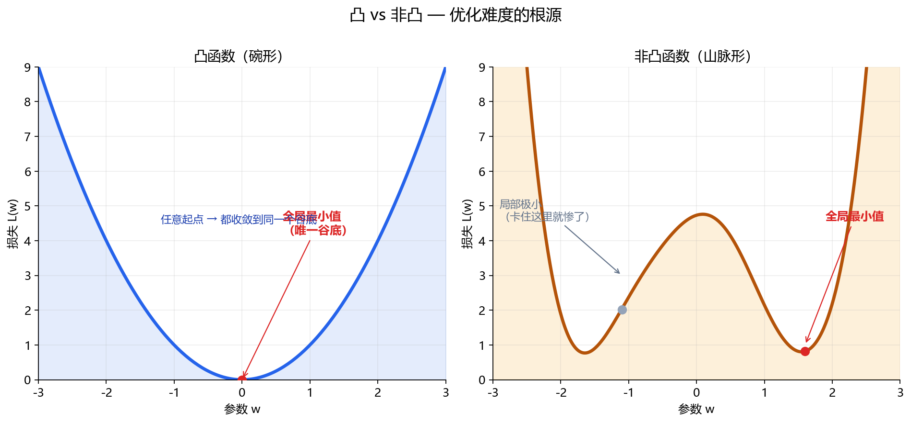

# 1.4.4 凸优化与非凸优化

> 属于：[[0-概述|优化]] > 1.4.4
> 掌握程度：**了解** — 知道深度学习优化为什么难

---

## 凸 vs 非凸：碗 vs 山脉

**凸函数**：像碗。任意两点连一条线，线在函数图像上方。

**非凸函数**：像山脉。有多个谷底（局部极小）、山口（鞍点）。

```
凸（碗形）：                     非凸（山脉形）：

        ∪                           /\    /\
       /  \                        /  \  /  \    /\
      /    \                      /    \/    \  /  \
     /      \                    /            \/    \
    └────────┘                  └────────────────────┘
    只有一个谷底，             多个谷底 + 鞍点，
    从哪出发都能到            从不同的起点出发
    同一个最低点              会停在不同的谷底
```



*图 1.4.4-1：左为凸函数（碗形，只有一个全局最小值，任何起点都收敛到它）；右为非凸函数（多谷底 + 鞍点，不同起点停在不同局部极小）。*

---

## 凸优化为什么"简单"

凸函数有一个决定性性质：

> **局部最优 = 全局最优。**

如果函数是凸的，梯度下降从任何起点出发都能找到全局最小值——不需要担心"卡在错误的地方"。1.1.5 讲过：Hessian 正定 → 唯一极小值 → 凸优化保证收敛到它。

经典凸优化问题：线性回归、逻辑回归、SVM、Lasso。它们的损失函数都是凸的。

---

## 深度学习为什么"难"：非凸

神经网络的损失函数几乎总是非凸的。问题不再是"只有一个谷底"，而是：

1. **多个局部极小**：不同随机初始化 → 收敛到不同的谷底
2. **鞍点（更麻烦）**：一个方向向上弯、另一个方向向下弯

### 为什么高维下鞍点才是主角

1.2.3 讲过：Hessian 全正定才是局部极小。维度越高，要求"所有方向同时向上弯"越苛刻——**百万维空间里，几乎不可能所有方向都向上弯**。

```
维度 = 1：极小值常见（一维只有两个方向）
维度 = 1,000,000：鞍点压倒性常见（只要有一个方向向下弯就是鞍点）
```

所以深度学习训练的典型困境不是"困在局部极小"，而是**在鞍点附近徘徊**（梯度接近零但没到谷底）。

### 实际训练中怎么应对

| 手段 | 作用 |
|---|---|
| Momentum / Adam | 惯性冲过鞍点（1.4.2） |
| 多种子训练 | 多次随机初始化，选验证集最好的 |
| 学习率调度 | 后期小步长精确定位（1.4.3） |
| BatchNorm | 平滑损失曲面，让优化更容易 |

### 一个反直觉的事实

深度学习的**局部极小通常已经足够好**——现代网络训练后往往能达到很好的泛化性能。真正的问题不在"找到全局最优"，而在"找到任何一个足够好的谷底并稳定收敛"。

---

## 总结

| | 凸优化 | 非凸优化（DL） |
|---|---|---|
| 形状 | 碗 | 山脉 |
| 局部最优 | = 全局最优 | 只是局部 |
| 难度 | 简单，保证收敛 | 困难，靠技巧 |
| 代表问题 | 线性回归、SVM | 所有神经网络 |
| 主要障碍 | 无 | **鞍点**（不是局部极小） |

> 深度学习优化的主要敌人不是"困在局部极小"，而是"在高维鞍点附近徘徊"。Momentum、Adam、BatchNorm 这些技巧很大程度上都是在对抗鞍点。

---

- ← [[1.4.3 学习率、学习率调度与权重衰减|上一节：1.4.3 学习率与调度]]
- → [[1.4.5 约束与正则化（L1与L2）|下一节：1.4.5 约束与正则化]]
