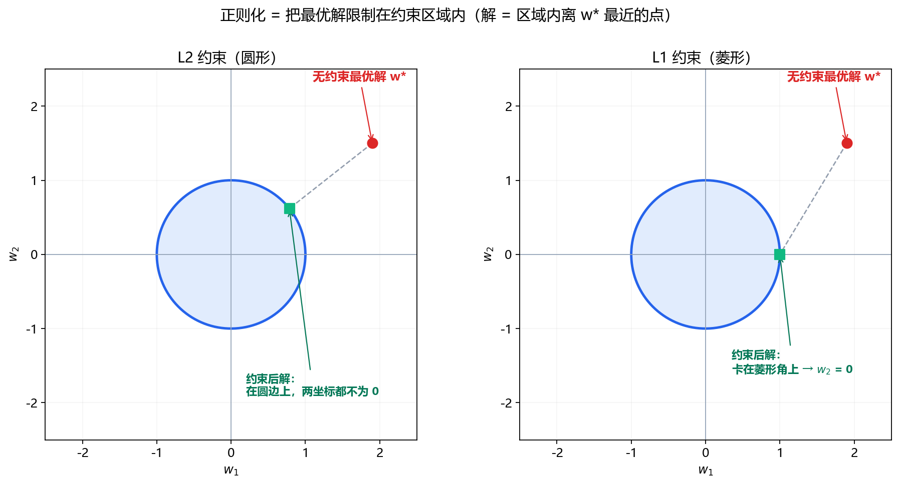

**本节内容**：L1/L2 的几何：圆让权重变小，菱形尖角让权重归零（稀疏）。

> 属于：[[0-概述-优化|优化]] > 1.4.5
> 掌握程度：**会用** — 理解正则化在"限制参数空间"上的几何含义

---

## 约束优化：在限制条件下找最优

**无约束**：找 $f(x)$ 的最小值，x 随便取。

**有约束**：找 $f(x)$ 的最小值，但 x 必须满足限制条件。

生活中几乎所有决策都有约束——预算有限、时间有限。深度学习里的约束最典型的就是**参数大小**：

> 损失 $L(w)$ 要小，但参数 $w$ 不能太大（限制条件）。

---

## L2 / L1 正则化的几何视角

### 统一写法

正则化 = 在损失上加惩罚项 + 等价于约束：

$$\min_w L(w) + \lambda \|w\|_p \quad \Longleftrightarrow \quad \min_w L(w) \quad \text{s.t.} \quad \|w\|_p \leq C$$

- 左边：**惩罚形式**（加到损失里，工程实现）
- 右边：**约束形式**（限制 w 必须落在范数球内，几何理解）

### 二维参数空间里的画面

假设只有两个参数 $w_1, w_2$。无约束的最优解在 $w^*$（红点），但正则化要求解落在蓝色约束区域内。**最终解 = 约束区域内离 $w^*$ 最近的点**：

*图 1.4.5-1：左图 L2 约束区域是圆形，解一般在圆边上、坐标几乎不为 0；右图 L1 约束区域是菱形，菱形的角正好落在坐标轴上，解容易恰好 $w_1=0$ 或 $w_2=0$——这就是 L1 产生稀疏解的几何原因。*

### 稀疏是什么意思

**稀疏（sparse）= 大多数元素为零。**

`[0.3, 0, 0, -0.2, 0, 0, 0, 1.1, 0, 0]`——10 个位置只有 3 个非零——就是稀疏向量。

L1 正则化让**权重向量稀疏**：训练结束后大部分权重精确等于 0，只有少数特征被保留 = **自动特征选择**（模型自己决定哪些特征有用，没用的直接归零）。

| | L2 | L1 |
|---|---|---|
| 结果 | 权重都很小（如 0.01、-0.05、0.02） | 权重要么是 0，要么明显非零 |
| 效果 | 整体缩小 | 归零（稀疏） |

### 为什么 L1 稀疏、L2 不稀疏

| | L2 约束区域 | L1 约束区域 |
|---|---|---|
| 形状 | 圆形（光滑边界） | 菱形（有尖角在坐标轴上） |
| 最优解倾向 | 圆边上任意点，坐标一般不为 0 | 取决于 w* 的位置（见下） |
| 结果 | 权重变小但不为 0 | 权重可被压到精确的 0 |
| 用途 | 防止过拟合（默认） | 特征选择（稀疏模型） |

**"投影一定落在角上"是过度简化**——只有 w* 位于"角的外侧"（垂足落在边段之外）时，最近点才是角。例如 w* = (2.2, 0.9)：垂足 (1.15, -0.15) 在菱形边段外 → 最近点是角 (1,0)（图 1.4.5-1 画的正是这个情形）。若 w* = (1.9, 1.5)：垂足 (0.7, 0.3) 在边内 → 最近点是边上的点，不是角。

> 所以"菱形有角 → 解在角上"不是 L1 稀疏的根本原因。真正的原因有两个：

**原因一：次梯度（零点不可导）**

L1 惩罚 $|w|$ 在 w=0 处不可导——左侧导数是 -1，右侧是 +1。梯度下降时，权重可以被**精确地停在 0**（不需要恰好落在 0 上，而是在 0 附近会被"推"回 0）。L2 惩罚 $w^2$ 处处可导，接近 0 时导数趋近 0，权重只会无限接近 0 但永远不会精确等于 0。

**原因二：高维几何（维度越高越明显）**

二维时 L1 球（菱形）的角只是 4 个点，稀疏现象不明显。但维度升高后，L1 单位球的"表面"大部分体积集中在**坐标轴附近**——高维空间里随机取 L1 球上的点，几乎必然有一个坐标接近 0。这就是为什么高维特征选择中 L1 的稀疏效应显著。

---

## 与 [[../1.3-概率统计/1.3.4 最大似然估计与最大后验估计|1.3.4 MAP]] 的对应

正则化不只是工程技巧，它是**先验信念的数学表达**（[[../1.3-概率统计/1.3.4 最大似然估计与最大后验估计|1.3.4]] 已推导）：

| 正则化 | 参数先验 | 几何 | 效果 |
|---|---|---|---|
| L2 | 高斯分布（参数集中在 0 附近） | 圆形约束 | 权重整体缩小 |
| L1 | 拉普拉斯分布（参数偏好为 0） | 菱形约束 | 权重精确归零 |

| 组合 | 含义 | 场景 |
|---|---|---|
| MSE + L2 | 高斯噪声 + 高斯先验 | **默认配置**（权重衰减） |
| MSE + L1 | 高斯噪声 + 拉普拉斯先验 | LASSO 特征选择 |
| MAE + L2 | 拉普拉斯噪声 + 高斯先验 | 抗异常值 + 防过拟合 |

---

## 深度学习中的实际使用

| 正则化方式 | 是否常用 | 说明 |
|---|---|---|
| **权重衰减（L2）** | ✅ 默认 | AdamW 的 weight_decay 参数 |
| L1 | 少见 | 希望特征稀疏时 |
| L1+L2（Elastic Net） | 少见 | 两者折中 |
| Dropout | ✅ 常用 | 另一种"约束"：随机丢弃神经元 |
| 数据增强 | ✅ 常用 | 增加有效样本，间接正则化 |

> 注意：Dropout 和数据增强是**针对模型/数据的正则化**，L1/L2 是**针对参数的约束**——都服务于同一个目标：防止过拟合（[[../1.3-概率统计/1.3.8 偏差—方差权衡|1.3.8]] 的高方差问题）。

---

## 总结

| 概念 | 一句话 |
|---|---|
| 约束优化 | 在限制条件下找最优（参数不能太大） |
| L2 几何 | 圆形约束区 → 权重缩小但不为 0 |
| L1 几何 | 菱形约束区 → 尖角把权重压到精确 0 |
| MAP 对应 | L2 = 高斯先验，L1 = 拉普拉斯先验 |
| DL 落地 | 权重衰减是默认；L1 用于特征选择 |

> 正则化的几何本质：**把无约束的最优解"拽"进一个限制区域**。圆的边界让权重变小，菱形的尖角让权重归零。

---

- ← [[1.4.4 凸优化与非凸优化|上一节：1.4.4 凸优化与非凸优化]]
- → [[0-概述-优化|返回优化概述]]
