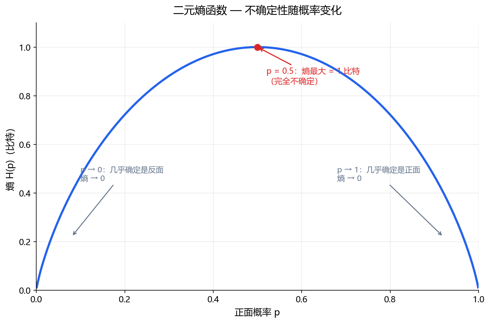

**本节内容**：信息量=惊讶程度，熵=平均惊讶度：抛硬币从 1 比特到 0 比特。

> 属于：[[0-概述-信息论|信息论]] > 1.5.1
> 掌握程度：**会用** — 信息论的基石概念

---

## 先看一个例子：信息量 = 惊讶程度

**"明天太阳从东边升起"**——这句话信息量为 0。你早就知道，说了等于没说。

**"明天有 30% 概率下暴雨"**——有信息。因为这不是必然事件。

**"明天会下血"**——信息量极大！因为概率极低，完全出乎意料。

直觉：**事件越不可能发生，它发生时带来的信息越大。**

这就是香农（Shannon）1948 年定义信息的方式：

$$I(x) = -\log_2 P(x)$$

- 概率 1 的事件：$I = -\log_2 1 = 0$（没信息）
- 概率 0.5 的事件：$I = 1$ 比特（抛硬币的结果——正还是反）
- 概率 0.125 的事件：$I = 3$ 比特（三次抛硬币才能确定的事件）

> 用 log₂ 的原因：信息以"比特"（bit）为单位——确定一个二选一的问题需要 1 比特。

---

## 熵：一个随机变量的平均信息量

单个事件的"惊讶度"还不够，一个随机变量有多个可能取值。**熵 = 所有可能取值的平均惊讶度**：

$$H(X) = \mathbb{E}[I(X)] = -\sum_x P(x) \log_2 P(x)$$

### 抛硬币的例子

| 硬币 | 分布 | 熵 |
|---|---|---|
| 公平硬币 | P(正)=0.5, P(反)=0.5 | $H = -0.5\log0.5 - 0.5\log0.5 = 1$ 比特 |
| 作弊硬币 | P(正)=0.9, P(反)=0.1 | $H = -0.9\log0.9 - 0.1\log0.1 ≈ 0.47$ 比特 |
| 必然硬币 | P(正)=1.0 | $H = 0$ |

- 公平硬币：每次抛都完全不确定 → 熵最大（1 比特）
- 作弊硬币：基本能猜到是正面 → 惊讶度低 → 熵小
- 必然事件：完全确定 → 熵为 0

**熵 = 不确定性的大小**。越不确定，熵越大。

### 二元熵函数（最重要的图）

*图 1.5.1-1：只有两个结果的随机变量（如硬币），熵作为正面概率 p 的函数。p=0.5 时熵最大（1 比特，完全不确定）；p 趋近 0 或 1 时熵趋近 0（几乎确定）。*

---

## 熵的几个性质

| 性质 | 含义 |
|---|---|
| $H(X) \geq 0$ | 信息量不为负 |
| 均匀分布熵最大 | 所有取值等概率时最不确定 |
| $H(X) \leq \log_2 \|X\|$ | 熵不超过取值数量的对数（均匀分布取等号） |
| 加性（独立时） | $H(X,Y) = H(X) + H(Y)$（X、Y 独立时） |

---

## 在深度学习中的位置

熵本身不直接出现在训练里，但它是**[[1.5.2 交叉熵|交叉熵]]和[[1.5.3 KL散度|KL 散度]]的地基**——后两者才是真正用的工具。

---

## 总结

| 概念 | 一句话 |
|---|---|
| 信息量 | $-\log P(x)$——事件越不可能，信息越大 |
| 熵 H(X) | 随机变量的平均信息量 = 不确定性大小 |
| 均匀分布 | 熵最大（最不确定） |
| 确定事件 | 熵为 0（没有信息） |

> 熵 = 一个随机变量的平均惊讶程度。公平硬币每次抛都让你猜，作弊硬币则基本可预测——熵衡量的是"有多难猜"。

---

- ← [[0-概述-信息论|信息论概述]]
- → [[1.5.2 交叉熵|下一节：1.5.2 交叉熵]]
