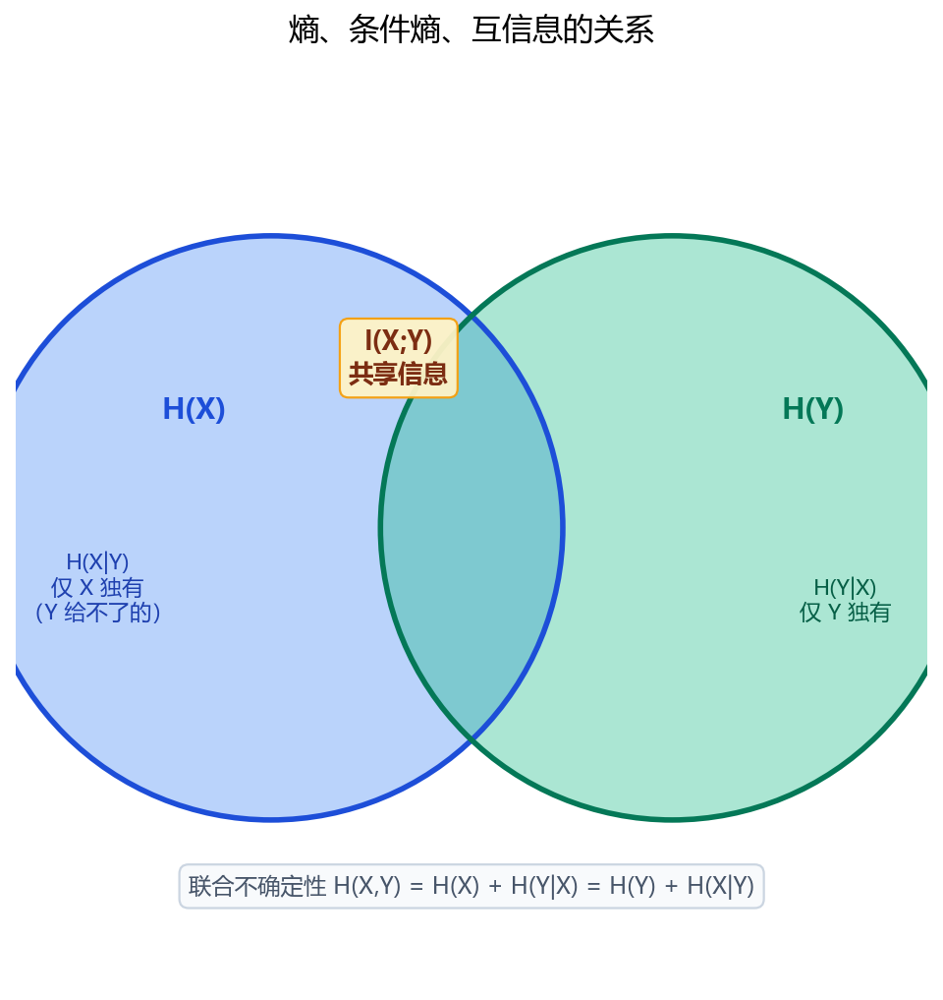

# 1.5.4 互信息

> 属于：[[0-概述|信息论]] > 1.5.4
> 掌握程度：**会用** — 表征学习的理论目标

---

## 先看一个例子：猜骰子

你有一个骰子 X（1~6 等概率）和一个"信息源"：

- **信息源 A**：告诉你骰子点数的奇偶 → 你从 6 个等可能变成 2 个等可能（不确定性从 $\log_2 6$ 降到 $\log_2 2 = 1$ 比特）→ A 给了你 1 比特信息
- **信息源 B**：告诉你骰子的精确点数 → 完全确定（0 不确定性）→ B 给了你 $\log_2 6 \approx 2.6$ 比特
- **信息源 C**：告诉你明天天气 → 和骰子完全无关 → C 给了你 0 比特

**互信息 = 知道一个变量后，另一个变量的不确定性减少了多少。**

$$I(X; Y) = H(X) - H(X \mid Y)$$

- $H(X)$ = 不知道 Y 时 X 的不确定性
- $H(X \mid Y)$ = 知道 Y 后 X 剩下的不确定性
- 差值 = Y 提供了多少关于 X 的信息

---

## 文氏图直觉

*图 1.5.4-1：两个圆的面积分别是 H(X) 和 H(Y)。重叠区域 = 互信息 I(X;Y)（共享信息）；只属于 X 的部分 = H(X|Y)（Y 给不了的信息）；只属于 Y 的部分 = H(Y|X)。*

### 三个量对照

| 量 | 含义 | 在图中 |
|---|---|---|
| $H(X)$ | X 的总不确定性 | 左圆全部 |
| $H(X \mid Y)$ | 知道 Y 后 X 剩余的不确定性 | 左圆独有部分 |
| $I(X; Y)$ | 知道 Y 后 X 不确定性减少的量 | 两圆重叠 |
| $H(X, Y)$ | X 和 Y 的联合不确定性 | 两圆并集 |

---

## 互信息的另一种形式

$$I(X; Y) = D_{KL}(P(X,Y) \| P(X)P(Y))$$

**互信息 = 联合分布和"独立假设"之间的 KL 散度**。

- 如果 X、Y 独立：$P(X,Y) = P(X)P(Y)$ → KL = 0 → 互信息 = 0（两个变量一点不相关）
- 如果 X 完全决定 Y：联合分布和独立假设差得远 → 互信息大

---

## 在深度学习中的位置

### 表征学习的理论目标

> **一个好的表征 z，应该和任务标签 y 的互信息大，和输入 x 的互信息小（只保留任务相关的部分）。**

- 监督学习：特征和标签互信息大 → 分类准确
- 对比学习（InfoNCE 损失）：本质上是在最大化"同一对象的两个视图"之间的互信息下界
- [[1.5.5 信息瓶颈|信息瓶颈]]（1.5.5）：明确优化"最大化 I(Z;Y) − βI(X;Z)"

### 计算难点

高维连续变量的互信息**几乎无法直接计算**（需要密度估计）。所以深度学习里常用的是**变分下界**（InfoNCE、NCE 等）来间接最大化互信息，而不是直接算。

---

## 总结

| 概念 | 一句话 |
|---|---|
| 互信息 I(X;Y) | 知道 Y 后 X 不确定性减少多少 |
| 独立变量 | 互信息 = 0（共享信息为 0） |
| 完全确定 | 互信息 = H(X)（Y 完全揭示 X） |
| 等价形式 | $D_{KL}(P(X,Y) \| P(X)P(Y))$ |
| DL 中 | 表征学习的理论目标（InfoNCE 是其下界） |

> 互信息 = 两个变量的共享信息量。知道一个，另一个的确定性增加多少——这是"学到了有用特征"的信息论度量。

---

- ← [[1.5.3 KL散度|上一节：1.5.3 KL 散度]]
- → [[1.5.5 信息瓶颈|下一节：1.5.5 信息瓶颈]]
