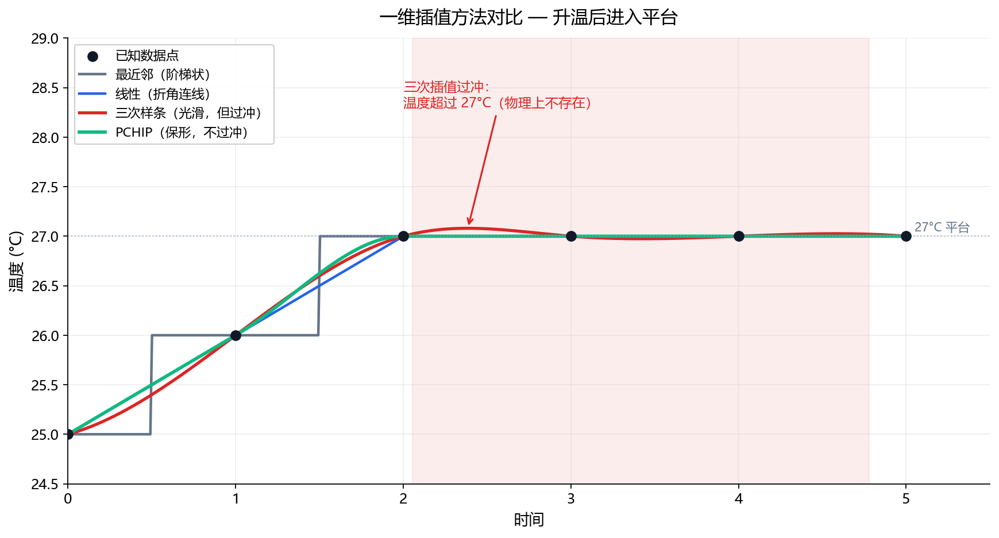
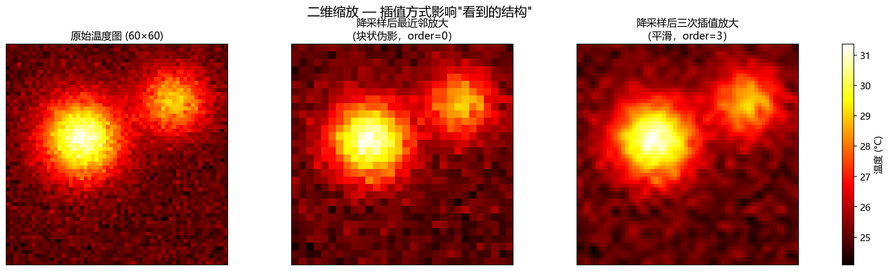
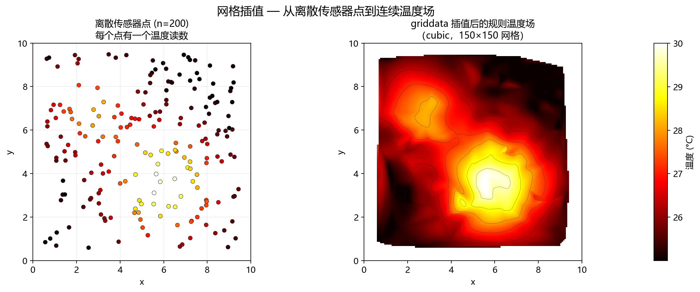

**本节内容**：滤波修坏点、插值补缺失、统计校验分布、FFT 看频域——模型前的数据打磨。

> 属于：[[0-概述-Python科学计算与数据工具|Python 科学计算与数据工具]] > 2.1.4
> 掌握程度：**会用** — 温度数据预处理的核心工具

---

## SciPy 是什么

NumPy 管**数组运算**，SciPy 管**科学计算**——滤波、插值、统计、优化、信号处理。它是 NumPy 的"专业工具箱"。

```python
import numpy as np
from scipy import signal, ndimage, interpolate, stats
```

**DL 中的定位**：深度学习模型之前的所有"数据打磨"（去噪、补缺、校验分布）都是 SciPy 的活。

---

## 滤波：去掉噪声，保留结构

### 中值滤波：修坏点

温度图上的坏点（传感器死像素）是孤立的异常值。**中值滤波**用邻域的中位数替代每个点——孤立坏点被抹平，真实结构不动。

```python
from scipy.ndimage import median_filter

temps = np.random.randn(100, 100) * 3 + 25   # 模拟温度图
temps[50, 50] = 99                            # 人为放一个坏点

cleaned = median_filter(temps, size=3)        # 3×3 邻域中值
# 坏点 99 → 被邻域中值替代；正常结构几乎不变
```

### 高斯滤波：去随机噪声

传感器噪声（随机抖动）用**高斯滤波**平滑——用邻域的加权平均替代，权重按高斯分布衰减。

```python
from scipy.ndimage import gaussian_filter

denoised = gaussian_filter(temps, sigma=1.0)
# sigma 越大 → 越平滑 → 细节丢失越多
```

| 滤波器 | 修什么 | 代价 |
|---|---|---|
| 中值滤波 | 孤立坏点（异常值） | 边缘轻微模糊 |
| 高斯滤波 | 随机噪声 | 细节/边缘模糊 |
| 均值滤波 | 随机噪声 | 比高斯更糊 |

> **先中值后高斯**是温度图预处理的标准组合：先除掉孤立坏点，再平滑随机噪声。

---

## 插值：补缺失、变分辨率

### 一维插值的方法详解

插值的本质：**用已知点的信息"猜"未知点的值**。不同的方法=不同的"猜法"，核心区别在两个维度：**光滑度**（连线还是曲线）和**是否振荡**（会不会凭空造出起伏）。

#### 方法全家桶

| 方法 | 原理 | 光滑度 | 振荡 | 适用 |
|---|---|---|---|---|
| **最近邻** | 取最近的已知点值 | 阶梯状（不连续） | 无 | 分类标签、掩膜 |
| **线性** | 相邻两点连直线 | 连续但折角 | 无 | 大多数数据默认 |
| **二次/三次** | 局部多项式拟合 | 平滑无折角 | 三次以上可能轻微 | 曲线型数据 |
| **样条** | 分段多项式拼接 | 高阶光滑 | 可能 | 需要光滑曲线 |
| **PCHIP** | 保单调的分段三次 | 光滑 | **无（保单调）** | 物理量（温度/压力） |
| **Akima** | 局部自适应多项式 | 光滑 | 轻微 | 局部变化剧烈 |
| **高次多项式** | 用所有点拟合一个高阶多项式 | 光滑 | **严重（Runge 现象）** | ❌ 实际不用 |

#### 三种典型"猜法"的直觉

**1. 最近邻**：已知点值直接"摊平"到最近的位置——像地板砖，一块一块的。只在"中间值没意义"时用（标签、掩膜）。

**2. 线性**：相邻两点之间画直线，未知点落在直线上。简单、单调、不会振荡——但连接处是折角，不够光滑。**大多数连续数据的默认选择**。

**3. 三次/样条**：不用直线，用一条"平滑经过已知点的曲线"。曲线在已知点处不仅值相等、斜率也连续——所以没有折角。代价：**可能"过冲"**——在数据突然变化的地方，曲线会超出已知值的范围再绕回来。

#### 为什么温度数据推荐 PCHIP

**过冲在物理数据上是灾难**：一段平滑升温的数据（25→26→27°C），三次插值可能在中间造出一个 27.5°C 的"假峰"——这个假峰在异常检测里就是**凭空造出的误报**。

PCHIP（保形分段三次插值）专门解决这个：它**保证插值结果不超出相邻已知点的范围、保持单调性**——数据是升的，插值结果就只升不降、不造峰。



*图 2.1.4-1：同一组温度数据（25→26→27°C 后进入平台）的四种插值。灰色阶梯 = 最近邻；蓝色折线 = 线性；红色曲线 = 三次样条——在平台处过冲到 27.08°C（红色区域标注的"假峰"）；绿色曲线 = PCHIP——平滑且不越界。*

> **选择准则一句话**：要光滑选三次/样条，要物理可信选 PCHIP，只要连续就线性，只有离散标签才最近邻。

#### 高次多项式为什么不用的原因：Runge 现象

用所有已知点拟合一个高阶多项式（拉格朗日插值），点数一多，**两端会剧烈振荡**——即使数据本身很平，多项式也会在边界大幅上下摆动。这是数值分析里的经典失败案例，实际插值从不这么干（分段低阶插值才是正道）。

```python
from scipy.interpolate import interp1d

# kind 参数选择：nearest / linear / quadratic / cubic / pchip / akima
f = interp1d(t, temp, kind="pchip")    # 温度推荐：保形
f = interp1d(t, temp, kind="linear")   # 一般默认：线性
```

### 二维缩放：改变分辨率

```python
from scipy.ndimage import zoom

small = temps[::2, ::2]                # 降采样（丢一半像素）
upscaled = zoom(small, 2, order=3)     # 插值放大回原尺寸（3 次样条）
```



*图 2.1.4-2：模拟温度场（25°C 背景 + 两个高斯热点）降采样一半后用不同插值放大回原尺寸。左：原始图；中：最近邻放大（order=0）——热点边缘出现明显的块状伪影；右：三次插值放大（order=3）——热点边缘平滑。*

> **DL 注意**：上采样/下采样改变分辨率时，插值方式（最近邻/线性/三次）会影响后续模型看到的"结构"——最近邻引入块状伪影，可能让模型把"块状边缘"误判为异常。温度图常用线性或三次插值。

### 网格插值：不规则点 → 规则网格

工业场景常见：传感器是离散点，要变成规则温度图。

```python
from scipy.interpolate import griddata

# 离散传感器点 (x, y) 和读数
points = np.random.rand(200, 2) * 10
values = np.sin(points[:, 0]) + points[:, 1]

# 插值到规则网格
grid_x, grid_y = np.mgrid[0:10:100j, 0:10:100j]
grid_temp = griddata(points, values, (grid_x, grid_y), method="cubic")
```



*图 2.1.4-3：左：200 个随机分布的传感器点，每个点一个温度读数（颜色=温度）；右：griddata 三次插值到 150×150 规则网格后的连续温度场（等高线叠加）。插值把"点数据"变成模型可以直接输入的"图像数据"。*

> **为什么需要网格化**：模型（CNN 等）吃的是规则网格（图像），不是散点。离散传感器读数必须先插值成规则矩阵——这是工业数据进入深度学习的第一道转换。传感器越密，插值结果越接近真实场；传感器稀疏的区域，插值只是"合理猜测"，不能当作实测值。

---

## 统计：校验分布、比较组间差异

### 分布工具

```python
from scipy import stats

# 正态分布对象（1.3.3 的高斯）
norm = stats.norm(loc=25, scale=1.5)     # 均值 25，标准差 1.5
norm.pdf(25.5)      # 概率密度
norm.cdf(27)        # P(X ≤ 27)
norm.ppf(0.95)      # 95% 分位数（阈值设定！）

# 假设检验：这批数据是不是正态？（1.3.5 的检验）
stat, p_value = stats.shapiro(temps.ravel())
p_value > 0.05      # True → 不能拒绝正态假设

# 两组数据是否有显著差异（t 检验）
t_stat, p_value = stats.ttest_ind(正常批次, 可疑批次)
```

> **与 1.3 章的连接**：`norm.ppf(0.95)` 就是 1.3.5 讲的分位数阈值；`shapiro` 检验回答"能不能用 3σ 规则"；KDE 密度估计（1.3.3 延伸）就是 `stats.gaussian_kde`。

### 多元统计：异常检测的统计地基

```python
from scipy.stats import multivariate_normal, gaussian_kde

# 多元高斯拟合（PaDiM 的原理，1.3.7 详讲）
rv = multivariate_normal(mean=mu, cov=sigma)
score = rv.pdf(new_sample)          # 概率密度 = 异常分数

# KDE 非参数密度估计（1.3.3 延伸）
kde = gaussian_kde(features)        # 不需要分布假设
density = kde(new_sample)
```

---

## 信号处理：卷积与频域

```python
from scipy import signal

# 快速卷积（比手动循环快得多）
result = signal.fftconvolve(image, kernel, mode="same")

# 滑动平均
smoothed = signal.convolve(series, np.ones(5)/5, mode="valid")

# Savitzky-Golay 滤波：平滑曲线同时保留趋势
smooth_curve = signal.savgol_filter(temp_series, window_length=15, polyorder=3)

# FFT：频域分析（[[../../15-频域与物理信息/|15-频域与物理信息]]的工具）
freqs = np.fft.fft2(temps)          # 二维傅里叶变换
```

> **与 [[../../15-频域与物理信息/|15-频域与物理信息]] 的连接**：这里只要求会用 `fftconvolve`/`fft2`；"频域异常检测"（整体温漂 = 低频、局部热点 = 高频）在那里展开。

---

## 总结

| 模块 | 干什么 | 温度场景 |
|---|---|---|
| `ndimage` 滤波 | 中值修坏点、高斯去噪 | 预处理标准组合 |
| `interpolate` | 补缺失、变分辨率、网格化 | 时间缺口、传感器点→图 |
| `stats` | 分布拟合、检验、KDE | 正态校验、阈值、PaDiM |
| `signal` | 卷积、FFT、平滑 | 频域分析基础 |
| `linalg` | 矩阵分解（svd/inv） | 比 NumPy 更全 |

> SciPy 一句话：**NumPy 管"算"，SciPy 管"处理"**。滤波去噪、插值补缺、分布校验——模型看到的数据质量由它决定。温度异常检测的统计基线（PCA、高斯建模、KDE）也大量依赖它。

---

- ← [[2.1.3 NumPy数组、广播、索引与向量化|上一节：2.1.3 NumPy]]
- → [[0-概述-Python科学计算与数据工具|返回 2.1 概述]]（下一节 2.1.5 pandas 待编写）
