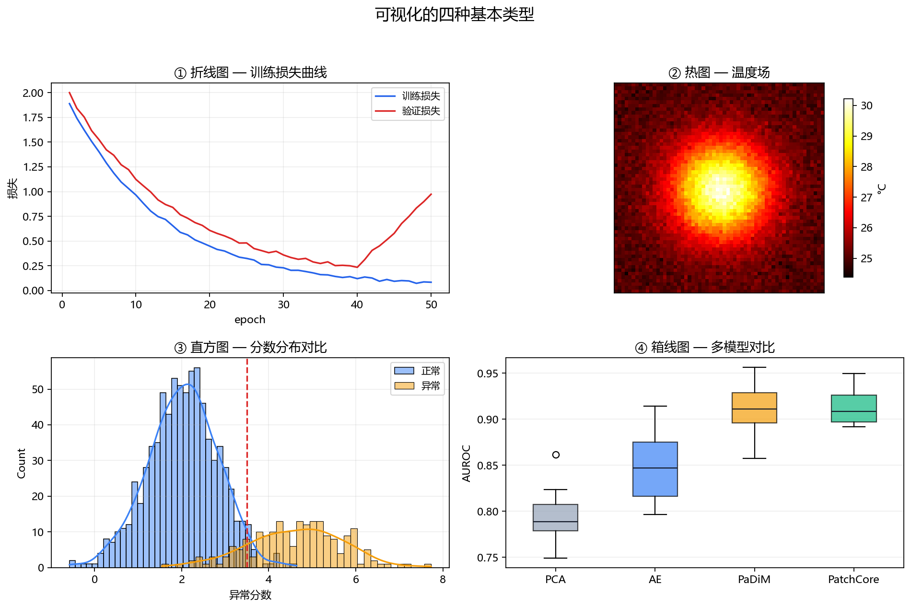

**本节内容**：四种基本图：折线看趋势、热图看空间、直方图看分布、箱线图看对比。

> 属于：[[0-概述-Python科学计算与数据工具|Python 科学计算与数据工具]] > 2.1.6
> 掌握程度：**深入** — 看懂数据是深度学习的第一能力

---

## 可视化的四个基本场景

| 场景 | 图类型 | DL 中的例子 |
|---|---|---|
| **变化趋势** | 折线图 plot | 训练/验证损失曲线、学习率调度 |
| **空间分布** | 热图 imshow/heatmap | 温度图、特征图、注意力图 |
| **统计分布** | 直方图/密度图 hist/kde | 分数分布、误差分布 |
| **分组对比** | 箱线图/柱状图 box/bar | 不同模型、不同种子、不同类别的指标对比 |



*图 2.1.6-1：四宫格示例——左上：折线图（训练损失曲线）；右上：热图（温度场）；左下：直方图（分数分布）；右下：箱线图（多模型对比）。这四种类型覆盖了深度学习 90% 的可视化需求。*

---

## Matplotlib 基础

### 核心概念：figure（画布）+ axes（子图）

```python
import matplotlib.pyplot as plt

# 一张画布，1×2 两个子图
fig, axes = plt.subplots(1, 2, figsize=(10, 4))

# 在第一个子图画折线
axes[0].plot(epochs, train_loss, label="训练")
axes[0].plot(epochs, val_loss, label="验证")
axes[0].set_xlabel("epoch")
axes[0].set_ylabel("损失")
axes[0].legend()
axes[0].set_title("训练损失曲线")

# 在第二个子图画散点
axes[1].scatter(x, y, s=10, alpha=0.5)

plt.tight_layout()
plt.savefig("figure.png", dpi=150)   # 保存（不是 plt.show）
```

> **训练脚本惯例**：`plt.savefig()` 保存到实验目录，不要 `plt.show()`（无显示环境会卡住）。本库所有图的生成脚本都遵循这个模式（viz/scripts/）。

### 常用图类型速查

```python
plt.plot(x, y)              # 折线
plt.scatter(x, y)           # 散点
plt.hist(data, bins=50)     # 直方图
plt.imshow(matrix)          # 热图（图像）
plt.bar(labels, values)     # 柱状图
plt.boxplot(groups)         # 箱线图
plt.contourf(X, Y, Z)       # 填充等高线
```

---

## Seaborn：统计图更简单、更漂亮

Seaborn 基于 matplotlib，专注**统计可视化**——一行代码画出带置信带的分布图。

```python
import seaborn as sns

# 直方图 + 密度曲线（替代 plt.hist）
sns.histplot(scores, bins=50, kde=True)

# 分组分布对比（比多个 hist 更清晰）
sns.boxplot(data=df, x="model", y="auroc")
sns.violinplot(data=df, x="model", y="auroc")

# 相关性热图（特征关系一目了然）
sns.heatmap(corr_matrix, annot=True, cmap="coolwarm")
```

| 场景 | matplotlib | seaborn |
|---|---|---|
| 快速画一张 | ✅ 直接 | ✅ 也行 |
| 分布 + 密度 | hist | **histplot(kde=True)** |
| 分组对比 | 手动画多个 | **boxplot/violinplot** |
| 相关性矩阵 | imshow | **heatmap** |

> **分工建议**：训练曲线、温度图用 matplotlib（精确控制）；统计对比、分布分析用 seaborn（一行出结果）。

---

## 深度学习四类可视化实战

### 1. 损失曲线（监控训练）

```python
plt.plot(epochs, train_loss, label="train")
plt.plot(epochs, val_loss, label="val")
plt.xlabel("epoch"); plt.ylabel("loss")
plt.legend()
# 看什么：训练↓验证↓ = 正常；训练↓验证↑ = 过拟合（1.3.8）
```

### 2. 温度热图（看空间结构）

```python
plt.imshow(temps, cmap="hot", vmin=20, vmax=35)   # 固定色标！
plt.colorbar(label="温度 (°C)")
```

> **固定色标是关键**：`vmin/vmax` 写死，否则每张图自动缩放，两张图没法对比（1.3.3 的图注提到过）。

### 3. 分数分布（异常检测核心）

```python
sns.histplot(normal_scores, bins=50, kde=True, label="正常")
sns.histplot(anomaly_scores, bins=50, kde=True, label="异常")
plt.axvline(threshold, color="red", linestyle="--")
plt.legend()
# 看什么：两分布重叠程度 = 检测难度（1.3.5 的 AUROC）
```

### 4. 模型对比（实验报告）

```python
sns.boxplot(data=results_df, x="model", y="auroc")
# 看什么：中位数、方差、离群点——比只报均值诚实得多（1.3.5 的置信区间）
```

---

## 本库的图是怎么生成的

本 vault 的 viz/scripts/ 里所有图都遵循统一规范（详见 skill 的 viz 规则）：

```
viz/
├── scripts/  X.X.N-N_描述.py    ← 脚本（可复现）
└── images/   X.X.N-N_描述.png   ← 输出（md 引用）
```

- 中文：`plt.rcParams['font.family'] = 'Microsoft YaHei'`
- 保存：`plt.savefig(path, dpi=160, bbox_inches='tight')`
- 图注：md 中每张图配斜体图注，解释每个元素

> **读这些脚本 = 最好的可视化学习**：1.4.3-1 的损失曲线、1.3.5-1 的分数直方图、1.3.3-2 的热图，都是真实生成代码。

---

## 总结

| 概念 | 一句话 |
|---|---|
| figure/axes | 画布/子图——一张图可以多个子图 |
| 四类图 | 折线（趋势）/热图（空间）/直方图（分布）/箱线（对比） |
| seaborn | 统计图一行出：histplot/boxplot/heatmap |
| 固定色标 | vmin/vmax 写死，图才能互相对比 |
| 保存惯例 | savefig 到实验目录，不用 show |

> 可视化一句话：**折线看趋势、热图看空间、直方图看分布、箱线图看对比**。深度学习 90% 的"看数据"需求这四种图就够——本库所有插图都是它们的组合。

---

- ← [[2.1.5 pandas表格、元数据与实验结果整理|上一节：2.1.5 pandas]]
- → [[0-概述-Python科学计算与数据工具|返回 2.1 概述]]（下一节 2.1.7 scikit-learn 待编写）
