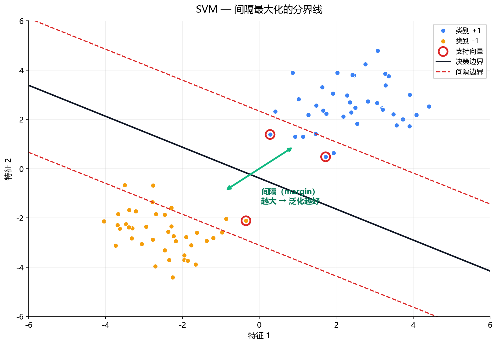
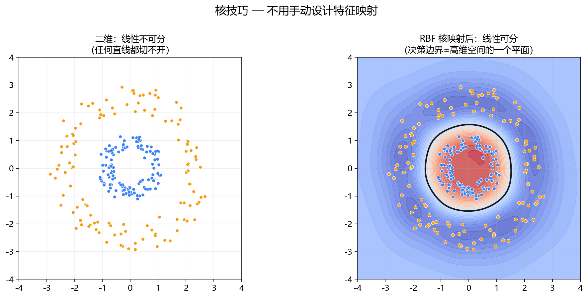
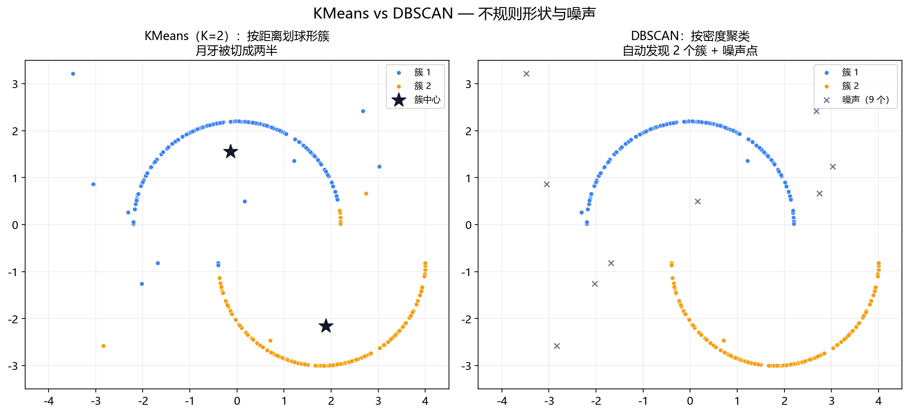

**本节内容**：SVM 找间隔最大的分界线，KMeans/DBSCAN 无标签自动分组——深度学习前的传统模型。

> 属于：[[0-概述-Python科学计算与数据工具|Python 科学计算与数据工具]] > 2.1.8
> 掌握程度：**会用** — 深度学习之前的传统模型，原理与用途

---

## 为什么还要学经典模型

深度学习之前，SVM 和聚类是机器学习的顶梁柱。现在它们退居二线，但仍是：

1. **深度学习基线的对照**——新方法必须比它们好才有意义（路线图原则）
2. **小数据场景的主力**——样本只有几百张时，经典模型往往比深度学习更稳
3. **无监督探索的工具**——聚类是"拿到数据第一件事"的一部分

---

## SVM：找"间隔最大"的分界线

### 直觉：不是随便一条分界线

两类点，要画一条线分开。**哪条最好？** 贴着点画的线容易被噪声干扰；离两类都尽量远的线对新样本容错最好。



*图 2.1.8-1：线性 SVM 在两类数据上学到的决策边界（黑线）。红色虚线为间隔边界，绿色双向箭头为间隔（margin）——SVM 找的是间隔最大的分界线。红色空心圈是支持向量：只有它们决定边界位置，其余点不影响。*

**SVM 找的是"离两类数据都最远"的分界线**——这个"最远"的宽度叫**间隔（margin）**。间隔越大，对新样本的容错越好（泛化越强）。

### 支持向量是谁

分界线确定后，**只有离分界线最近的那几个点**决定线的位置——这些点叫**支持向量（Support Vector）**（图 2.1.8-1 中的红色空心圈）。

> **为什么重要**：SVM 的决策只依赖少数支持向量，而不是所有数据——所以它**对远离边界的点不敏感**（稳健），并且可以只保留支持向量做预测（省内存）。

### 核技巧：一条直线不够时

数据线性不可分时（比如同心圆），SVM 用**核函数**把数据映射到高维空间，在高维里线性可分：



*图 2.1.8-2：左：同心圆数据在二维平面线性不可分（任何直线都切不开）；右：RBF 核隐式映射到高维空间后的决策边界（颜色=决策函数值，黑线=边界）——在二维投影上呈现为闭合曲线，实际是在高维空间用平面切开的。*

常见核：线性核、RBF 核（高斯核，最常用）、多项式核。**RBF 核 ≈ 把每个点变成一个小山包，在高维空间切平面**——不用自己设计特征映射，核函数替你做了。

> **与深度学习的对比**：SVM + RBF 核 ≈ 手动设计特征空间的"浅层模型"；深度学习是**自动学习**特征映射。SVM 适合小数据、特征已有、线性或近线性问题；深度学习适合大数据、原始输入（图像/文本）。

### One-Class SVM：只有正常数据的异常检测

异常检测场景只有一个类（正常）。One-Class SVM 学一个"正常数据的边界"：

```python
from sklearn.svm import OneClassSVM

ocsvm = OneClassSVM(nu=0.05)   # nu = 期望的异常比例上限
ocsvm.fit(X_normal)            # 只喂正常数据
ocsvm.predict(X_test)          # 1=正常, -1=异常
```

这是 11-异常检测基础里统计基线的核心成员（17. 经典统计与单类学习）。

---

## 聚类：无标签数据自动分组

聚类回答"数据天然分成几堆"——不需要标签，是**无监督**的。

### KMeans：按距离划地盘

```
1. 随机放 K 个中心点
2. 每个点归到最近的中心 → 形成 K 簇
3. 每个簇重新计算中心（均值）
4. 重复 2-3 直到中心不再移动
```

```python
from sklearn.cluster import KMeans

kmeans = KMeans(n_clusters=3, random_state=42)
kmeans.fit(X)
kmeans.labels_       # 每个样本的簇号
kmeans.cluster_centers_   # 三个中心点
```

**局限**：
- K 要自己定（用肘部法：画"K vs 簇内距离"找拐点）
- 只能找到**球形**簇（按距离划分）
- 对噪声和离群点敏感

### DBSCAN：按密度划地盘

不指定 K，按"密度"聚类——**高密度区连成簇，低密度区是噪声**：

```python
from sklearn.cluster import DBSCAN

dbscan = DBSCAN(eps=0.5, min_samples=5)
dbscan.fit(X)
dbscan.labels_        # -1 = 噪声点（不属任何簇）
```



*图 2.1.8-3：同一组数据（两个月牙形簇 + 散布噪声点）。左：KMeans（K=2）按距离把月牙切成两半，且把噪声硬分进某个簇；右：DBSCAN 正确发现 2 个任意形状的簇，并把 9 个低密度点标为噪声（×）。*

|        | KMeans | DBSCAN                 |
| ------ | ------ | ---------------------- |
| 需要指定簇数 | ✅ 要（K） | ❌ 不用                   |
| 簇形状    | 球形     | 任意形状                   |
| 噪声处理   | 没有噪声概念 | **自动标出噪声（-1）**         |
| 参数     | K      | eps（邻域半径）+ min_samples |

> **异常检测视角**：DBSCAN 的"噪声点"本身就是异常候选——低密度区域的数据点。这是聚类和异常检测的直接交叉。

---

## 在深度学习路线中的位置

```
数据探索：聚类（无监督看数据结构）→ 2.1.8
传统基线：SVM / One-Class SVM → 和深度模型对比
异常检测基线：IsolationForest / OCSVM → 11 章展开
```

| 场景 | 用谁 |
|---|---|
| 拿到新数据先看结构 | KMeans / DBSCAN + 可视化（2.1.6） |
| 小样本分类 | SVM（RBF 核） |
| 小样本异常检测 | One-Class SVM / IsolationForest（11 章） |
| 大数据 + 原始输入 | 深度学习 |

---

## 总结

| 概念 | 一句话 |
|---|---|
| SVM | 找间隔最大的分界线，只有支持向量决定边界 |
| 核技巧 | 高维空间切平面，不用手动设计特征 |
| One-Class SVM | 只学正常边界，异常检测基线 |
| KMeans | 按距离划 K 个球形簇（K 要自己定） |
| DBSCAN | 按密度聚类，自动发现簇数和噪声 |

> 经典模型一句话：**SVM 是"最有把握的分界线"，聚类是"无标签的自动分组"**。它们是小数据场景的主力、深度学习的对照基线，也是理解深度学习"自动学特征"优势的参照系。

---

- ← [[2.1.7 scikit-learn统计学习与指标|上一节：2.1.7 scikit-learn]]
- → [[0-概述-Python科学计算与数据工具|返回 2.1 概述]]（下一节 2.1.9 OpenCV 待编写）
