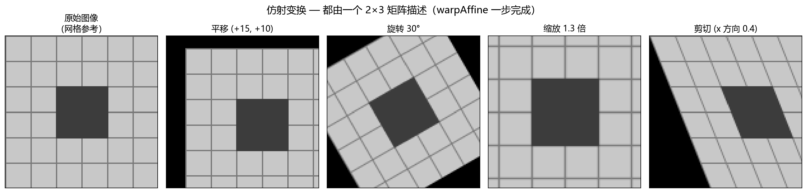
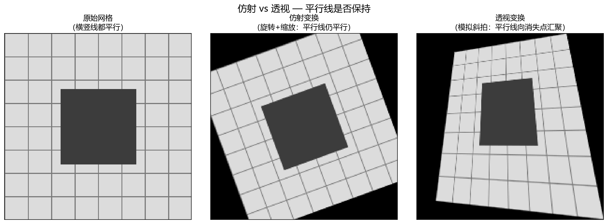
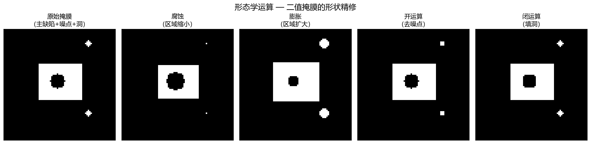
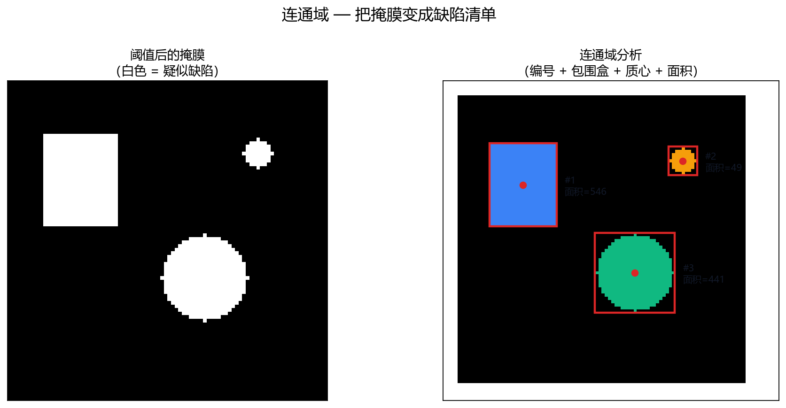
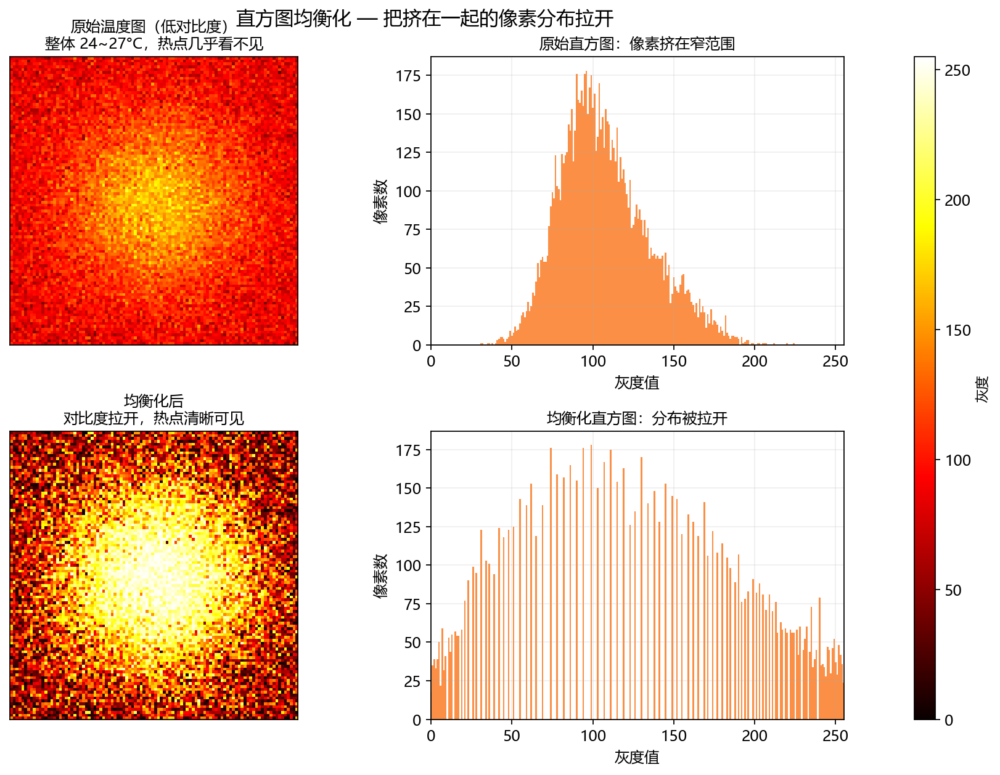
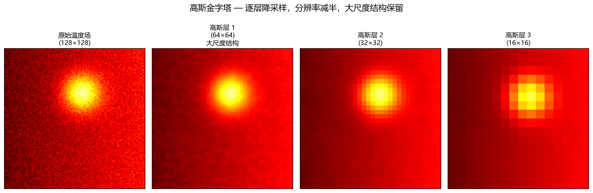

**本节内容**：图像级处理工业标准：仿射变换、对齐、滤波、阈值、形态学、连通域、金字塔、视频流、dnn。

> 属于：[[0-概述-Python科学计算与数据工具|Python 科学计算与数据工具]] > 2.1.9
> 掌握程度：**会用** — 图像级预处理与缺陷分析的标准工具

---

## OpenCV 是什么

工业图像处理的标准库（C++ 内核，Python 绑定）。与 SciPy 的分工：

| | SciPy | OpenCV |
|---|---|---|
| 定位 | 科学计算通用 | **图像处理专用**（工业界事实标准） |
| 速度 | 快 | **极快**（C++ 优化，实时级） |
| 图像功能 | 基础滤波/插值 | 几何变换/对齐/形态学/连通域/边缘全套 |
| 温度场景 | 数值处理 | 图像级操作（ROI/缺陷区域/配准） |

> 温度矩阵本质是**单通道图像**——OpenCV 的图像操作直接适用，而且比手写 NumPy 快得多。

---

## 读取与基本操作

```python
import cv2
import numpy as np

# 读取（注意：返回 BGR 顺序，不是 RGB！）
img = cv2.imread("photo.jpg")          # 彩色 → (H, W, 3)
gray = cv2.imread("photo.jpg", 0)      # 灰度 → (H, W)
temps = np.random.randn(100, 100) * 3 + 25   # 温度矩阵直接当图像用

# 保存
cv2.imwrite("output.png", gray)

# 尺寸与类型
h, w = gray.shape
gray = gray.astype(np.float32)         # 训练输入常用 float32
```

> **BGR 陷阱**：`cv2.imread` 默认 BGR。显示彩色图要转 RGB：`cv2.cvtColor(img, cv2.COLOR_BGR2RGB)`。单通道温度图不受影响。

---

## 色彩空间：把"颜色"变成"可分割的量"

### 常见色彩空间

| 色彩空间 | 通道含义 | 用途 |
|---|---|---|
| BGR/RGB | 红绿蓝 | 默认格式（显示用） |
| **HSV** | 色调/饱和/明度 | **分割的标配**——颜色用色调描述 |
| YCrCb | 亮度/色差 | 亮度分离（光照不变性） |

### 为什么 HSV 适合分割

BGR 里"红色"要三个通道组合描述，阈值很难写。HSV 里红色 = 色调在某个范围——**一条阈值搞定**：

```python
hsv = cv2.cvtColor(img, cv2.COLOR_BGR2HSV)
mask = cv2.inRange(hsv, (150, 50, 50), (180, 255, 255))   # 红色范围
# inRange：三个通道都在 [低, 高] 区间内 → 255
```

```python
# 通道分离与合并
b, g, r = cv2.split(img)          # 分离
merged = cv2.merge([b, g, r])     # 合并
```

> **温度场景**：温度图本身是单通道灰度，不涉及色彩空间。但如果现场有 RGB 相机辅助（多模态，路线图 27 章），HSV 分割是标配。YCrCb 的亮度通道对光照变化不敏感——工厂灯光变化时的稳定选择。

---

## 几何变换：改位置、改大小、改方向

### 第一步：四种基本操作

```python
# 缩放
resized = cv2.resize(img, (64, 64))                  # 指定尺寸
resized = cv2.resize(img, None, fx=0.5, fy=0.5)      # 按比例

# 翻转
flip_h = cv2.flip(img, 1)        # 水平翻转（左右）
flip_v = cv2.flip(img, 0)        # 垂直翻转（上下）

# 旋转 90°（OpenCV 只提供 90° 整数倍）
rotated = cv2.rotate(img, cv2.ROTATE_90_CLOCKWISE)
```

> **与数据增强的连接**：翻转/旋转/缩放是深度学习数据增强的基础操作（路线图 4 章：正则化里的数据增强）——注意 08-对比学习 里强调过：增强必须保持物理语义（温度图翻转 90° 可能改变"上热下冷"的物理意义）。

**局限**：想旋转任意角度（如 30°）或斜向拉伸（剪切），没有现成 API——需要**变换矩阵**。

### 第二步：仿射变换——用矩阵统一所有线性变换 + 平移

**仿射变换 = 线性变换（旋转/缩放/剪切）+ 平移**。用一个 2×3 矩阵描述：

$$M = \begin{bmatrix} a & b & t_x \\ c & d & t_y \end{bmatrix}$$

- 左上 2×2 部分：旋转、缩放、剪切（线性部分）
- 右列 (t_x, t_y)：平移

**任意点 (x, y) 的变换**：

$$\begin{bmatrix} x' \\ y' \end{bmatrix} = \begin{bmatrix} a & b \\ c & d \end{bmatrix} \begin{bmatrix} x \\ y \end{bmatrix} + \begin{bmatrix} t_x \\ t_y \end{bmatrix}$$

**关键性质：平行线变换后仍是平行线**（直线保持直线、比例保持）。

```python
# 方式一：手动构造矩阵（平移为例）
M = np.float32([[1, 0, 10],    # 平移：x 方向 +10 像素
                [0, 1, -5]])   #         y 方向 -5 像素
warped = cv2.warpAffine(img, M, (w, h))

# 方式二：OpenCV 帮构造（旋转 + 缩放）
M = cv2.getRotationMatrix2D(center=(w/2, h/2), angle=30, scale=1.0)
warped = cv2.warpAffine(img, M, (w, h))

# 方式三：由 3 对对应点直接解出矩阵（配准的核心！）
src_pts = np.float32([[10, 10], [100, 10], [10, 100]])     # 模板上的 3 个点
dst_pts = np.float32([[15, 12], [105, 11], [12, 103]])     # 图像上对应的 3 个点
M = cv2.getAffineTransform(src_pts, dst_pts)               # 解出变换矩阵
aligned = cv2.warpAffine(image, M, (w, h))
```



*图 2.1.9-3：同一图像（带网格参考）的四种仿射变换。平移：整体位移；旋转：绕中心转 30°；缩放：放大 1.3 倍；剪切：斜向拉伸。所有变换都由一个 2×3 矩阵描述，`warpAffine` 一步完成。*

### 第三步：透视变换——仿射解决不了的"斜着看"

**问题场景**：相机斜着拍产品/面板时，矩形在画面里变成梯形——平行线向远处汇聚（透视畸变）。仿射变换保持平行线平行，**无法校正**，需要透视变换。

**数学**：3×3 矩阵，比仿射多两个参数 (g, h) 负责"远近缩放"——远处的点被压缩得更厉害，形成透视感。8 个参数需要 **4 对对应点**（矩形的 4 个角）才能解出：

$$M = \begin{bmatrix} a & b & c \\ d & e & f \\ g & h & 1 \end{bmatrix}$$

```python
# 透视变换：校正斜拍的文档/面板
pts_src = np.float32([[0, 0], [200, 0], [0, 300], [200, 300]])   # 原图矩形的 4 角
pts_dst = np.float32([[10, 20], [190, 0], [0, 280], [210, 290]])  # 目标矩形的 4 角
M = cv2.getPerspectiveTransform(pts_src, pts_dst)
corrected = cv2.warpPerspective(img, M, (w, h))
```

### 第四步：仿射 vs 透视——一张表决定用哪个

| | 仿射变换 | 透视变换 |
|---|---|---|
| 矩阵 | 2×3（6 个参数） | 3×3（8 个参数） |
| 平行线 | **保持平行** | **可以不平行（向消失点汇聚）** |
| 典型效果 | 平移/旋转/缩放/剪切 | 校正斜拍、3D 投影 |
| 需要对应点 | 3 对 | 4 对 |
| 函数 | `warpAffine` | `warpPerspective` |



*图 2.1.9-5：同一网格图的两种变换。左：原始网格，横竖线平行；中：仿射变换（旋转+缩放）后平行线**仍平行**；右：透视变换（模拟相机斜拍）后平行线**向消失点汇聚**——这就是两者的本质区别。*

| 场景 | 变换 |
|---|---|
| 产品表面基本是平面、只需摆正（平移/旋转/缩放） | **仿射** |
| 相机斜拍、面板有透视畸变（矩形变梯形） | **透视** |
| 文档/二维码/面板校正（工业标准场景） | **透视**（4 角定位） |

> **与对齐路线的连接**：2.1.9 对齐小节里"有透视畸变 → 特征点 + 透视（4 对点）"就是这里的落地——透视变换不只是校正畸变，也是把斜拍的图"摆正"到标准视角，让后续模型看到一致的空间结构。

---

## 对齐：让每张图位置一致

工业场景中产品在视野里会有微小平移和旋转——**不对齐直接进模型 = 特征错位**（1.1.3 讲过像素高度相关，错位会毁掉空间结构）。

### 路线一：模板匹配（平移）

```python
result = cv2.matchTemplate(image, template, cv2.TM_CCOEFF_NORMED)
min_val, max_val, min_loc, max_loc = cv2.minMaxLoc(result)
# max_loc = 模板最佳匹配位置（左上角坐标）
```

**原理**：把模板在图像上滑动，每个位置算一次归一化相关，得到响应图，最大值位置 = 匹配位置。只能处理平移。

### 路线二：相位相关（亚像素平移）

**原理**：利用傅里叶变换的"平移性质"——图像平移 (dx, dy)，它的频谱只改变相位、不改变幅值，且相位变化量正比于平移量。

```
图像 f(x, y) 平移 (dx, dy)
        ↓ 傅里叶变换
频谱幅值不变，相位变化 = -2π(dx·u + dy·v)
        ↓
从相位差反解出 (dx, dy) —— 精度可达亚像素
```

**为什么比模板匹配好**：
- **亚像素精度**（模板匹配只能到整数像素）
- 对光照变化、噪声更稳健（只关心相位不关心幅值）

```python
shift, response = cv2.phaseCorrelate(
    cv2.dft(img1.astype(np.float32), flags=cv2.DFT_ROWS),
    cv2.dft(img2.astype(np.float32), flags=cv2.DFT_ROWS))
# shift = (dx, dy)，亚像素精度
```

> **与 [[../../15-频域与物理信息/|15-频域与物理信息]] 的连接**：相位相关用到的"傅里叶变换"就是那里的工具——这里先用它的性质，原理（频谱/相位）那边展开。

### 路线三：特征点 + 仿射变换（平移 + 旋转 + 缩放）

**为什么前两条路线不够**：模板匹配和相位相关都只能处理**平移**。产品有旋转时（歪了几度），需要能同时估计"平移 + 旋转 + 缩放"的方法。

**思路**：不比较整张图，而是找**对应点**——两张图里"同一个物理位置"的点对。有了点对，就能解出变换矩阵（4 步）：

```
1. 找特征点：在两张图里找"独特的位置"（角点/斑点，如 SIFT）
   特征点 = 图像里"最容易认出"的点（拐角、纹理突变处）
2. 匹配：每个特征点有描述子（一个向量），找两张图里描述子最接近的点对
3. 解矩阵：取 3 对点 → getAffineTransform → 2×3 矩阵（平移+旋转+缩放）
4. 变换：warpAffine 把图像摆正
```

**为什么用 3 对点**：仿射矩阵有 6 个未知参数，1 对点给 2 个方程（x 和 y）——3 对点恰好解出 6 个未知数（几何变换小节讲过）。

```python
# 1. 找特征点（角点/斑点）
sift = cv2.SIFT_create()
kp1, des1 = sift.detectAndCompute(template, None)
kp2, des2 = sift.detectAndCompute(image, None)

# 2. 匹配特征点（BFMatcher：暴力匹配最近邻）
bf = cv2.BFMatcher()
matches = bf.knnMatch(des1, des2, k=2)                 # 每个点找 2 个候选
good = [m for m, n in matches if m.distance < 0.75 * n.distance]
# 比率测试：最近邻明显优于次近邻才算可靠匹配（过滤误匹配）

# 3. 取前 3 对点解仿射矩阵
src_pts = np.float32([kp1[m.queryIdx].pt for m in good[:3]])
dst_pts = np.float32([kp2[m.trainIdx].pt for m in good[:3]])
M = cv2.getAffineTransform(src_pts, dst_pts)

# 4. 变换对齐
aligned = cv2.warpAffine(image, M, (w, h))
```

> **三条路线的选择**：只有平移 → 模板匹配或相位相关（快）；有旋转 → 特征点 + 仿射（稳）；有透视畸变 → 特征点 + 透视（4 对点）。

---

## 滤波：与 SciPy 同族但更快

```python
# 高斯滤波（去随机噪声）
blur = cv2.GaussianBlur(temps, (5, 5), sigmaX=1.0)

# 中值滤波（修坏点）
median = cv2.medianBlur(temps, 5)

# 双边滤波（去噪同时保边缘！）
bilateral = cv2.bilateralFilter(temps, d=9, sigmaColor=50, sigmaSpace=50)
```

| 滤波 | 效果 | 保边缘？ |
|---|---|---|
| 高斯 | 去噪 | ❌ 边缘一起糊 |
| 中值 | 去噪+修坏点 | 中等 |
| **双边** | 去噪 | ✅ **边缘保留**（颜色差大的区域不混合） |

> **温度图推荐**：要保留产品边缘的锐利度（边缘本身就是结构信息），用双边滤波代替高斯——高斯会把"边缘温度梯度"也抹平。

---

## 边缘检测：找结构边界

```python
# Sobel：一阶导数近似（1.2.1 的梯度！）
sobel_x = cv2.Sobel(temps, cv2.CV_64F, 1, 0, ksize=3)   # x 方向梯度
sobel_y = cv2.Sobel(temps, cv2.CV_64F, 0, 1, ksize=3)   # y 方向梯度
mag = np.sqrt(sobel_x**2 + sobel_y**2)                  # 梯度幅值

# Canny：完整边缘检测（高斯去噪 → 梯度 → 双阈值 → 连接）
edges = cv2.Canny(temps, threshold1=50, threshold2=150)
```

> **与 1.2.1 的连接**：Sobel 就是在算图像函数的偏导数（梯度）——温度场里"温度梯度大的地方 = 边缘"。Canny 是工业标准的边缘提取器。

---

## 阈值处理：从灰度图到二值图

滤波后的温度图还是连续值，缺陷判定需要**二值化**：

```python
# 固定阈值
ret, mask = cv2.threshold(temps, 27.0, 255, cv2.THRESH_BINARY)
# temps > 27 → 255（白色，缺陷候选）；否则 0

# OTSU：自动选阈值（不用手调！）
ret, mask = cv2.threshold(temps, 0, 255, cv2.THRESH_BINARY + cv2.THRESH_OTSU)
# OTSU 在类间方差最大的阈值处分割——适合双峰分布
```

> **与 1.3.5 的连接**：`threshold(27.0)` 就是"分位数/固定阈值"的落地；OTSU 自动选择阈值，相当于"数据自己决定阈值"。异常检测的"阈值怎么定"问题在这里有了具体工具。

---

## 形态学：处理形状的工具

**形态学运算作用于二值图**，回答"这个形状怎么变形"。



*图 2.1.9-1：同一二值掩膜（白色=缺陷候选）的四种形态学运算。腐蚀：白色区域缩小（去掉小的孤立点）；膨胀：白色区域扩大（填补小洞）；开运算=先腐蚀后膨胀（去噪点）；闭运算=先膨胀后腐蚀（填小洞）。*

| 运算 | 效果 | 用途 |
|---|---|---|
| **腐蚀** | 白色区域缩小 | 去掉小的孤立噪声点 |
| **膨胀** | 白色区域扩大 | 填补小洞、连接断裂 |
| **开运算**（先蚀后胀） | 去小噪点，大形状不变 | **去噪标准操作** |
| **闭运算**（先胀后蚀） | 填小洞，大形状不变 | **补洞标准操作** |

```python
kernel = np.ones((3, 3), np.uint8)

eroded = cv2.erode(mask, kernel, iterations=1)
dilated = cv2.dilate(mask, kernel, iterations=1)
opened = cv2.morphologyEx(mask, cv2.MORPH_OPEN, kernel)     # 开
closed = cv2.morphologyEx(mask, cv2.MORPH_CLOSE, kernel)    # 闭
```

> **缺陷检测流程中的位置**：阈值得到粗糙掩膜 → 开运算去掉噪点 → 闭运算填洞 → 连通域分析。形态学决定了"哪些点算缺陷区域"。

---

## 连通域与轮廓：把掩膜变成"缺陷清单"

阈值 + 形态学后，得到一张二值图。两种方式提取区域：

### 连通域：区域统计

```python
num_labels, labels, stats, centroids = cv2.connectedComponentsWithStats(
    mask, connectivity=8)

# num_labels = 区域数（0 是背景）
# stats = 每个区域的 (x, y, w, h, 面积)
# centroids = 每个区域的质心
```



*图 2.1.9-2：左：阈值+形态学后的二值掩膜（白色=疑似缺陷）；右：连通域分析给每个独立区域编号（红框=包围盒、红点=质心、数字=区域号），附带每块的面积。*

```python
# 过滤：只保留面积大于阈值的区域（去掉小噪声块）
big_areas = [i for i in range(1, num_labels) if stats[i, cv2.CC_STAT_AREA] > 100]

for i in big_areas:
    x, y, w, h, area = stats[i]
    print(f"缺陷 {i}: 位置 ({x},{y}) 大小 {w}×{h} 面积 {area}")
```

### 轮廓：边界像素

```python
contours, hierarchy = cv2.findContours(mask, cv2.RETR_EXTERNAL,
                                       cv2.CHAIN_APPROX_SIMPLE)

for cnt in contours:
    area = cv2.contourArea(cnt)              # 区域面积
    perimeter = cv2.arcLength(cnt, True)     # 周长
    x, y, w, h = cv2.boundingRect(cnt)       # 包围盒
    circularity = 4 * np.pi * area / (perimeter ** 2)   # 圆度（1=圆，越小越细长）
```

| | 连通域 | 轮廓 |
|---|---|---|
| 得到什么 | 区域统计（面积/质心/包围盒） | 边界点序列 |
| 适合 | 快速区域筛选 | 形状分析（圆度、细长度） |
| 速度 | 快 | 稍慢 |

> **与 16 章指标的连接**：连通域/轮廓就是"区域级异常"的最小单元——面积、包围盒、质心、圆度是计算 IoU、Dice、区域召回的基础（路线图 16 章：异常通常大于 50 像素，应增加区域级指标）。

---

## Hough 变换：找直线和圆

Hough 变换回答"图里有没有直线/圆，在哪"——把"找形状"变成"投票"：

```python
# 直线检测（HoughLinesP：概率版，返回线段端点）
lines = cv2.HoughLinesP(edges, rho=1, theta=np.pi/180,
                        threshold=80, minLineLength=30, maxLineGap=10)
# lines = [[[x1, y1, x2, y2], ...]] 每条线段两端点

# 圆检测（HoughCircles）
circles = cv2.HoughCircles(gray, cv2.HOUGH_GRADIENT, dp=1.2,
                           minDist=30, param1=100, param2=50,
                           minRadius=10, maxRadius=80)
# circles = [[[cx, cy, r], ...]] 圆心和半径
```

**直觉**：每个边缘点在"它可能属于的直线参数空间"里投一票，票数最多的直线参数胜出。

**工业用途**：
- 产品边缘线定位（对齐的另一种方式——找到边缘线就找到了位置）
- 圆形封装/焊点检测（HoughCircles）
- 与 06-分类检测分割 的对比：Hough 是**无学习的几何检测**，YOLO 是**学习式检测**——结构固定（直线/圆）用 Hough，任意物体用深度学习。

---

## 直方图均衡化：增强对比度

```python
# 温度图对比度低时（整体 24~26°C 看不出细节）
equalized = cv2.equalizeHist(temps.astype(np.uint8))
# 把像素分布"拉开"，暗处更暗、亮处更亮，细节更明显
```



*图 2.1.9-6：上：低对比度温度图（整体 24~27°C，热点几乎看不见）+ 挤在窄范围的直方图；下：均衡化后对比度拉开，热点清晰可见 + 分布被拉开的直方图。*

**原理**：把像素值的累积分布"拉直"——原图灰度挤在 24~27 的小范围（直方图集中在一段），均衡化按累积分布重新映射，让各灰度级的像素数尽量均匀（直方图铺开）。

> **注意物理语义**：直方图均衡化改变绝对温度值（非线性映射），适合**人看**（可视化），不适合直接喂模型——模型学的是温度绝对值的物理意义。可视化用均衡化、训练用原始值。

### 直方图分析与伽马校正

```python
# 直方图：统计每个灰度级的像素数
hist = cv2.calcHist([gray], [0], None, [256], [0, 256])
# 看什么：分布是否双峰（双峰 = 背景/目标可分，OTSU 的依据）

# 伽马校正：非线性对比度增强
gamma = 0.5                                  # <1 提亮暗部，>1 压暗暗部
lookup = np.array([(i / 255) ** gamma * 255 for i in range(256)]).astype(np.uint8)
adjusted = cv2.LUT(gray, lookup)             # 查表变换
```

**均衡化 vs 伽马**：

| | 直方图均衡化 | 伽马校正 |
|---|---|---|
| 原理 | 让直方图均匀分布（自适应） | 固定幂函数映射（可控制） |
| 参数 | 无 | gamma 一个参数 |
| 适用 | 整体对比度低 | 需要精确控制亮度（提亮暗部/压暗高光） |

> 温度图暗部细节（低温区域的小异常）用 gamma < 1 提亮后可能更可见——但和均衡化一样，**只用于人看**，不用于喂模型。

---

## 图像金字塔：多尺度分析

**金字塔 = 同一图像的一系列不同分辨率版本**：

```python
# 高斯金字塔：逐层降采样（分辨率减半）
lower = cv2.pyrDown(img)      # (H,W) → (H/2, W/2)
higher = cv2.pyrUp(img)       # (H,W) → (2H, 2W)

# 拉普拉斯金字塔：相邻层之差（保留细节）
# 拉普拉斯层 = 高斯层 - 上采样(下一高斯层)
```



*图 2.1.9-4：模拟温度场（左侧渐变 + 热点 + 噪声）连续 3 次降采样（128→64→32→16）。分辨率减半，大尺度结构（渐变/热点）保留，小尺度细节（噪声）逐层消失——这就是"多尺度"的含义。*

> **与 [[../../15-频域与物理信息/|15-频域与物理信息]] 的直接连接**：多尺度残差 = 金字塔思想——"整体温漂属于低频（大尺度），局部热点属于高频（小尺度）"。**B1/B2 实验（多尺度 PCA）就是金字塔思想在温度场的落地**。金字塔是"多尺度分析"最直观的工程实现。

---

## 视频流：连续帧处理

工业现场是**流**不是单张图——相机每秒几十帧，要逐帧处理：

```python
# 打开视频/摄像头
cap = cv2.VideoCapture("record.mp4")    # 或 VideoCapture(0) 摄像头

while True:
    ret, frame = cap.read()             # 读一帧
    if not ret:                         # 读完了
        break
    # 逐帧处理（对齐 → 滤波 → 阈值 → 连通域）
    result = process_frame(frame)

cap.release()                           # 记得释放
```

### 帧差法：运动/变化检测

```python
diff = cv2.absdiff(frame_current, frame_previous)
# 连续两帧之差 → 变化区域
```

> **与路线图 24 章的连接**：连续温度帧 = 时序异常检测的输入（升温速率、扩散速度、冷却曲线异常）。帧差法是最简单的"时间变化"检测——深度时序模型（ConvLSTM/TCN）是它的学习版。

---

## dnn 模块：用 OpenCV 跑深度学习模型

**路线图 30 章（模型部署）的 OpenCV 路径**：训练好的模型导出 ONNX 后，**不依赖 PyTorch 环境**也能推理：

```python
import cv2.dnn as dnn

# 加载 ONNX 模型
net = dnn.readNetFromONNX("model.onnx")

# 预处理：和训练时完全一致（尺寸/缩放/均值）！
blob = dnn.blobFromImage(img, scalefactor=1/255.0,
                         size=(64, 64), mean=(0,), swapRB=False)
net.setInput(blob)
output = net.forward()          # 推理结果
```

**为什么重要**：
- 部署端不需要安装 PyTorch（只装 OpenCV）
- C++ 部署时是同一套 API（`cv::dnn`）
- 工业现场轻量推理的常用路径（比 ONNX Runtime 更简单，功能少一些）

> **与 30 章的连接**：完整部署流程（ONNX 导出 → 精度验证 → 前后处理一致性）在 17-模型压缩与部署 展开。这里只需知道 OpenCV 是**轻量推理选项之一**——前后处理必须和训练时完全一致（路线图 30 章：工业故障常来自管线差异而非模型权重）。

---

## 温度图的完整预处理流程

```
原始温度图
  → 1. 对齐（模板匹配/相位相关/特征点+仿射）
  → 2. 双边滤波（去噪保边缘）
  → 3. 阈值 → 掩膜（温度异常点，OTSU 自动选阈值）
  → 4. 形态学（开运算去噪、闭运算补洞）
  → 5. 连通域/轮廓（缺陷清单：位置/面积/质心/形状）
  → 6. 统计基线 or 深度学习模型
```

> 这套流程**不依赖深度学习**就能做基础缺陷检测（统计基线 B0/B1 的工程实现），也是深度模型的输入预处理。

---

## 与 scikit-image 的选择

| 场景 | 用谁 |
|---|---|
| 工业图像、速度优先 | **OpenCV** |
| 科研原型、读论文代码 | scikit-image（接口更 Pythonic） |
| 两者功能重叠 | 几何变换/滤波/形态学/连通域都有 |

> 选 OpenCV 的理由：**工业界事实标准**——部署（C++/边缘设备）、文档、社区支持都最全。

---

## 总结

| 概念 | 一句话 |
|---|---|
| 仿射变换 | 旋转/缩放/剪切 + 平移 = 一个 2×3 矩阵，warpAffine 一步完成 |
| 仿射 vs 透视 | 平行线保持（3 对点） vs 不保持（4 对点） |
| 对齐 | 平移用模板匹配/相位相关，有旋转用特征点+仿射 |
| 滤波 | 双边滤波去噪**保边缘**（比高斯更适合温度图） |
| 阈值 | threshold 固定阈值 / OTSU 自动选阈值 |
| 形态学 | 开运算去噪、闭运算补洞——掩膜的精修 |
| 连通域/轮廓 | 掩膜 → 缺陷清单（面积/质心/形状） |
| 边缘检测 | Sobel = 温度梯度，Canny = 标准边缘提取 |
| Hough | 投票找直线/圆——无学习的几何检测 |
| 色彩空间 | HSV 让颜色变成一条阈值（分割标配） |
| 金字塔 | 多尺度分析——多尺度 PCA 的工程思想 |
| 视频流 | 连续帧 + 帧差法——时序异常的输入 |
| 直方图/伽马 | 对比度增强（只用于人看，不喂模型） |
| dnn 模块 | ONNX 轻量推理——部署不依赖 PyTorch |

> OpenCV 一句话：**图像级处理的工业标准**。仿射变换摆正、滤波去噪、阈值二值化、形态学精修、连通域出清单、金字塔看多尺度、视频流看时序——深度学习模型之前和之后的图像操作，都是它的活。

---

- ← [[2.1.8 经典机器学习模型SVM与聚类|上一节：2.1.8 经典机器学习]]
- → [[0-概述-Python科学计算与数据工具|返回 2.1 概述]]（下一节 2.1.10 工程规范待编写）
